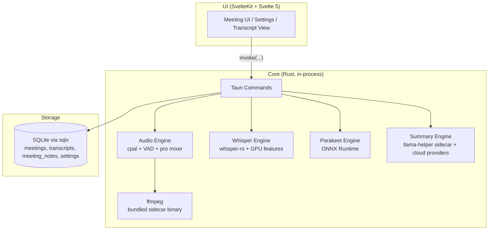

# System Architecture

muesly is a single-process Tauri desktop application. There is no separate backend service — the SvelteKit UI and the Rust core ship together and communicate over Tauri's IPC, with all data stored in a local SQLite database.

## High-Level Architecture Diagram

## Component Details

### UI (SvelteKit)

* Svelte/TypeScript interface for managing meetings, taking notes while recording (a TipTap editor is the primary surface; the live transcript is a toggleable side panel), viewing live transcripts, editing summaries, and configuring providers.
* Talks to the Rust core via Tauri commands (`invoke(...)`). No HTTP, no external server.

### Rust Core

* **Tauri Commands:** Single IPC entrypoint. Commands are organised by domain (`api`, `audio`, `whisper_engine`, `parakeet_engine`, `summary`, `providers`, `database`, etc.) and registered in `app/src-tauri/src/lib.rs`.
* **Audio Engine** (`audio/`): Captures the microphone via `cpal`, and system audio through platform-specific capture: WASAPI loopback on Windows, a CoreAudio process tap on macOS (14.4+, requires the System Audio Recording permission), and ALSA/PulseAudio on Linux. Performs RMS-based ducking, professional mixing, and VAD-filtered chunking before handing audio to the transcription engine. ffmpeg ships as a Tauri sidecar binary (downloaded at build time via `ffmpeg-sidecar`).
* **Whisper Engine** (`whisper_engine/`): `whisper-rs` (bindings to whisper.cpp) running in-process. GPU acceleration via Cargo features: Metal/CoreML (macOS), CUDA/Vulkan/HIPBLAS (Windows/Linux). Falls back to CPU.
* **Parakeet Engine** (`parakeet_engine/`): NVIDIA Parakeet TDT 0.6B v3 ONNX via ONNX Runtime, as an alternative to Whisper.
* **Summary Engine** (`summary/`): Generates meeting summaries with either a local model (Qwen 3.5 2B/4B or Gemma 3 1B/4B GGUF, run via the `llama-helper` workspace sidecar binary backed by `llama-cpp-2`) or another provider (Ollama, Anthropic Claude, OpenAI, Groq, xAI Grok, OpenRouter, or a custom OpenAI-compatible endpoint). The user's in-meeting notes are folded into the generation `custom_prompt` (wrapped in `<user_context>`) so the summary is shaped by what the user wrote, not just the transcript. Generation is two-pass: a canonical English base summary, then an optional translation to a user-selected output language (or a soft English normalization when a non-English transcript is summarized in English). Transcript language is auto-detected with `whatlang`, and the per-meeting summary-language override is persisted in the meeting's `metadata.json`.
* **Database** (`database/`): Local SQLite via `sqlx` with `runtime-tokio`. Repositories cover meetings, transcripts, notes (`meeting_notes`, saved via `api_save_meeting_notes` / `api_get_meeting_notes`), and settings. Migrations run at app startup.
