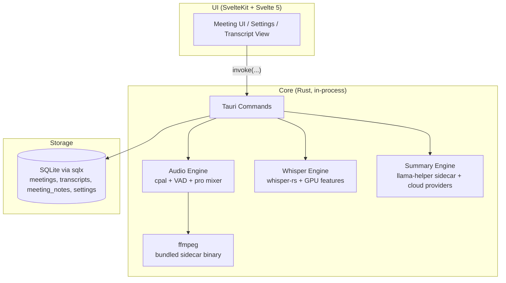

# System Architecture

muesly is a single-process Tauri desktop application. There is no separate backend service — the SvelteKit UI and the Rust core ship together and communicate over Tauri's IPC, with all data stored in a local SQLite database.

## High-Level Architecture Diagram

## Component Details

### UI (SvelteKit)

* Svelte/TypeScript interface for managing meetings, taking notes while recording (a TipTap editor is the primary surface; the live transcript is a toggleable side panel), viewing live transcripts, editing summaries, and configuring providers.
* Talks to the Rust core via Tauri commands (`invoke(...)`). No HTTP, no external server.

### Rust Core

* **Tauri Commands:** Single IPC entrypoint. Commands are organised by domain (`api`, `audio`, `whisper_engine`, `summary`, `providers`, `database`, etc.) and registered in `app/src-tauri/src/lib.rs`.
* **Audio Engine** (`audio/`): Captures the microphone via `cpal`, and system audio through platform-specific capture: WASAPI loopback on Windows, a CoreAudio process tap on macOS (14.4+, requires the System Audio Recording permission), and ALSA/PulseAudio on Linux. Performs RMS-based ducking, professional mixing, and VAD-filtered chunking before handing audio to the transcription engine. Live VAD bridges 900 ms pauses on macOS and 400 ms elsewhere; the optional post-meeting quality pass reprocesses the mixed recording with 2,000 ms context and maps each replacement segment back to the dominant mic/system source on the original timeline. ffmpeg ships as a Tauri sidecar binary (downloaded at build time via `ffmpeg-sidecar`).
* **Whisper Engine** (`whisper_engine/`): `whisper-rs` (bindings to whisper.cpp) running in-process. GPU acceleration via Cargo features: Metal/CoreML (macOS), CUDA/Vulkan/HIPBLAS (Windows/Linux). Falls back to CPU. Preferred custom-vocabulary terms and calendar meeting terms are supplied as local prompt context; prior-segment prompt continuity is kept per stream (mic/system) and only carries text that passed the hallucination gate in a verified language. With language `auto`, an adaptive lock (`lang_lock.rs`) votes on probability-gated per-segment detections, forces disagreeing segments back to the stable language, follows a genuine language change only after sustained confident evidence (3 consecutive segments spanning >= 10 s), and once the lock settles the live worker re-transcribes the early "deciding" segments and re-emits them (upserted by `sequence_id`) so a meeting's first lines cannot stay in the wrong language.
* **Custom Dictionary** (`vocabulary.rs`): Durable preferred terms bias Whisper immediately. After normal confidence, hallucination, and cross-talk admission, the live worker retains at most two medium-confidence English candidates (one per preferred term) for a bounded post-recording comparison before the transcription task releases its model. The comparison preserves meeting context, prior-segment context, and every other vocabulary term while excluding only the candidate term. A materially higher-confidence prompted result plus conservative phonetic matching records at most one local alias observation per term and recording; learned aliases activate after evidence from two recordings. Persistence completes before the active cache changes, granular events merge learning into the frontend without overwriting edits, and learned aliases remain removable in settings alongside optional manual overrides. Matching is case-insensitive and boundary-aware, longer aliases win, conflicts across terms are rejected, and corrections never cascade. Loading the setting hydrates the in-process cache before transcription starts under the same serialized mutation lock. Each recording's `metadata.json` records the exact transcription provider/model, whether the quality pass was enabled, and its segment-count/duration distribution for later quality diagnosis.
* **Summary Engine** (`summary/`): Generates meeting summaries with either a local model (Qwen 3.5 2B/4B or Gemma 3 1B/4B GGUF, run via the `llama-helper` workspace sidecar binary backed by `llama-cpp-2`) or another provider (Ollama, Anthropic Claude, OpenAI, Groq, xAI Grok, OpenRouter, or a custom OpenAI-compatible endpoint). The user's in-meeting notes are folded into the generation `custom_prompt` (wrapped in `<user_context>`) so the summary is shaped by what the user wrote, not just the transcript. Generation is two-pass: a canonical English base summary, then an optional translation to a user-selected output language (or a soft English normalization when a non-English transcript is summarized in English). Transcript language is auto-detected with `whatlang`, and the per-meeting summary-language override is persisted in the meeting's `metadata.json`.
* **Meeting Chat** (`summary/chat.rs`): the "Ask anything" bar. `chat_ask` streams an answer about a meeting (context: transcript + summary + title, tag-wrapped with a prompt-injection-resistant system prompt) over a `tauri::ipc::Channel` as `started`/`token`/`done`/`error` events; `chat_cancel` aborts by `gen_id` (chat-owned cancellation registry, separate from summaries). Every provider streams real tokens: the local model emits per-token lines over the sidecar stdio protocol (`stream: true` requests, with a stop-token holdback so partial stop tokens never reach the UI), cloud/Ollama providers via SSE (`llm_client::generate_summary_streaming`). The frontend store treats `done`'s full text as authoritative. Conversations are ephemeral (per session, reset on meeting change); nothing is persisted.
* **Calendar** (`calendar/`): multi-source calendar integration. Sources are listed in `calendar_accounts` (the local macOS EventKit source plus any connected Google accounts) and each can be enabled independently. At record time every enabled source is fetched, the results are de-duplicated across sources (`dedup.rs`, before the matcher so a meeting present in both Google and its EventKit mirror doesn't downgrade confidence), and the pure platform-free scorer (`matching.rs`) picks the meeting "now"; high-confidence matches title the recording and a redacted snapshot is stored in `calendar_events` and injected into the summary as a `<meeting_context>` block.
  - **Local (EventKit, macOS):** `objc2-event-kit`, on-device, no account; authorization requested on the main thread with the completion handled off-main, fetches run off-main.
  - **Google (`google.rs`, all platforms, opt-in):** OAuth 2.0 loopback + PKCE (system browser, `127.0.0.1`), with the granular read-only `calendar.events.readonly` and `calendar.calendarlist.readonly` scopes. Refresh tokens live in the OS keychain (`google-oauth-`); the account email is the only identifier in SQLite; attendee emails are structurally never read. Identity via the userinfo endpoint. See [google-oauth-setup.md](google-oauth-setup.md).
  - Two egress hops are kept distinct: Hop A (device↔Google, whenever a Google account is enabled) and Hop B (device↔cloud LLM, governed by `LLMProvider::data_egress`: attendee names/notes withheld by default for remote, conference URL stripped, emails never sent).
* **Database** (`database/`): Local SQLite via `sqlx` with `runtime-tokio`. Repositories cover meetings, transcripts, notes (`meeting_notes`, saved via `api_save_meeting_notes` / `api_get_meeting_notes`), calendar snapshots (`calendar_events`), and settings. Migrations run at app startup.
* **Secrets** (`keychain/`): Cloud LLM and transcription provider API keys are stored in the OS keychain via the `keyring` crate (macOS Keychain, Windows Credential Manager, Linux Secret Service), never in the database. SQLite holds only non-secret settings; a one-time migration moves any legacy plaintext keys into the keychain, with a transitional dual-read fallback.
