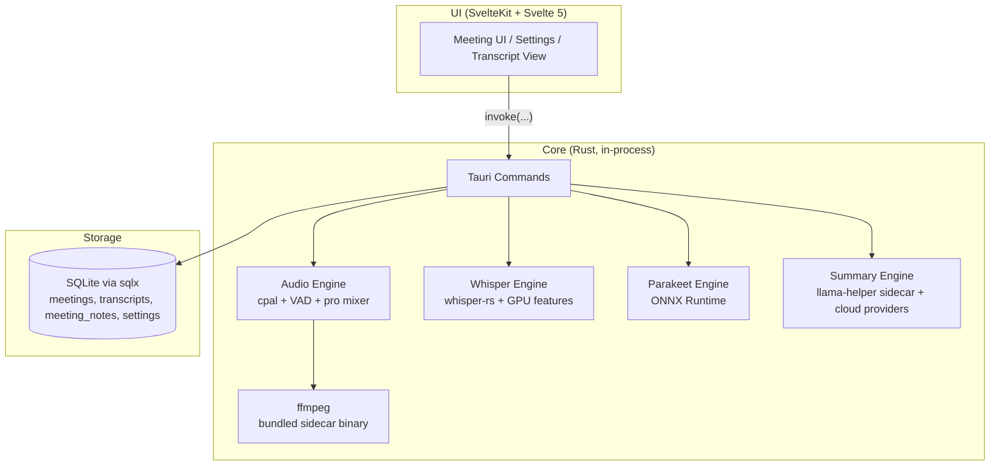

# System Architecture

muesly is a single-process Tauri desktop application. There is no separate backend service — the SvelteKit UI and the Rust core ship together and communicate over Tauri's IPC, with all data stored in a local SQLite database.

## High-Level Architecture Diagram

## Component Details

### UI (SvelteKit)

* Svelte/TypeScript interface for managing meetings, taking notes while recording (a TipTap editor is the primary surface; the live transcript is a toggleable side panel), viewing live transcripts, editing summaries, and configuring providers.
* Talks to the Rust core via Tauri commands (`invoke(...)`). No HTTP, no external server.

### Rust Core

* **Tauri Commands:** Single IPC entrypoint. Commands are organised by domain (`api`, `audio`, `whisper_engine`, `parakeet_engine`, `summary`, `providers`, `database`, etc.) and registered in `app/src-tauri/src/lib.rs`.
* **Audio Engine** (`audio/`): Captures the microphone via `cpal`, and system audio through platform-specific capture: WASAPI loopback on Windows, a CoreAudio process tap on macOS (14.4+, requires the System Audio Recording permission), and ALSA/PulseAudio on Linux. Performs RMS-based ducking, professional mixing, and VAD-filtered chunking before handing audio to the transcription engine. ffmpeg ships as a Tauri sidecar binary (downloaded at build time via `ffmpeg-sidecar`).
* **Whisper Engine** (`whisper_engine/`): `whisper-rs` (bindings to whisper.cpp) running in-process. GPU acceleration via Cargo features: Metal/CoreML (macOS), CUDA/Vulkan/HIPBLAS (Windows/Linux). Falls back to CPU.
* **Parakeet Engine** (`parakeet_engine/`): NVIDIA Parakeet TDT 0.6B v3 ONNX via ONNX Runtime, as an alternative to Whisper.
* **Summary Engine** (`summary/`): Generates meeting summaries with either a local model (Qwen 3.5 2B/4B or Gemma 3 1B/4B GGUF, run via the `llama-helper` workspace sidecar binary backed by `llama-cpp-2`) or another provider (Ollama, Anthropic Claude, OpenAI, Groq, xAI Grok, OpenRouter, or a custom OpenAI-compatible endpoint). The user's in-meeting notes are folded into the generation `custom_prompt` (wrapped in `<user_context>`) so the summary is shaped by what the user wrote, not just the transcript. Generation is two-pass: a canonical English base summary, then an optional translation to a user-selected output language (or a soft English normalization when a non-English transcript is summarized in English). Transcript language is auto-detected with `whatlang`, and the per-meeting summary-language override is persisted in the meeting's `metadata.json`.
* **Calendar** (`calendar/`): multi-source calendar integration. Sources are listed in `calendar_accounts` (the local macOS EventKit source plus any connected Google accounts) and each can be enabled independently. At record time every enabled source is fetched, the results are de-duplicated across sources (`dedup.rs`, before the matcher so a meeting present in both Google and its EventKit mirror doesn't downgrade confidence), and the pure platform-free scorer (`matching.rs`) picks the meeting "now"; high-confidence matches title the recording and a redacted snapshot is stored in `calendar_events` and injected into the summary as a `<meeting_context>` block.
  - **Local (EventKit, macOS):** `objc2-event-kit`, on-device, no account; authorization requested on the main thread with the completion handled off-main, fetches run off-main.
  - **Google (`google.rs`, all platforms, opt-in):** OAuth 2.0 loopback + PKCE (system browser, `127.0.0.1`), read-only `calendar.events.readonly`. Refresh tokens live in the OS keychain (`google-oauth-`); the account email is the only identifier in SQLite; attendee emails are structurally never read. Identity via the userinfo endpoint. See [google-oauth-setup.md](google-oauth-setup.md).
  - Two egress hops are kept distinct: Hop A (device↔Google, whenever a Google account is enabled) and Hop B (device↔cloud LLM, governed by `LLMProvider::data_egress`: attendee names/notes withheld by default for remote, conference URL stripped, emails never sent).
* **Database** (`database/`): Local SQLite via `sqlx` with `runtime-tokio`. Repositories cover meetings, transcripts, notes (`meeting_notes`, saved via `api_save_meeting_notes` / `api_get_meeting_notes`), calendar snapshots (`calendar_events`), and settings. Migrations run at app startup.
* **Secrets** (`keychain/`): Cloud LLM and transcription provider API keys are stored in the OS keychain via the `keyring` crate (macOS Keychain, Windows Credential Manager, Linux Secret Service), never in the database. SQLite holds only non-secret settings; a one-time migration moves any legacy plaintext keys into the keychain, with a transitional dual-read fallback.
