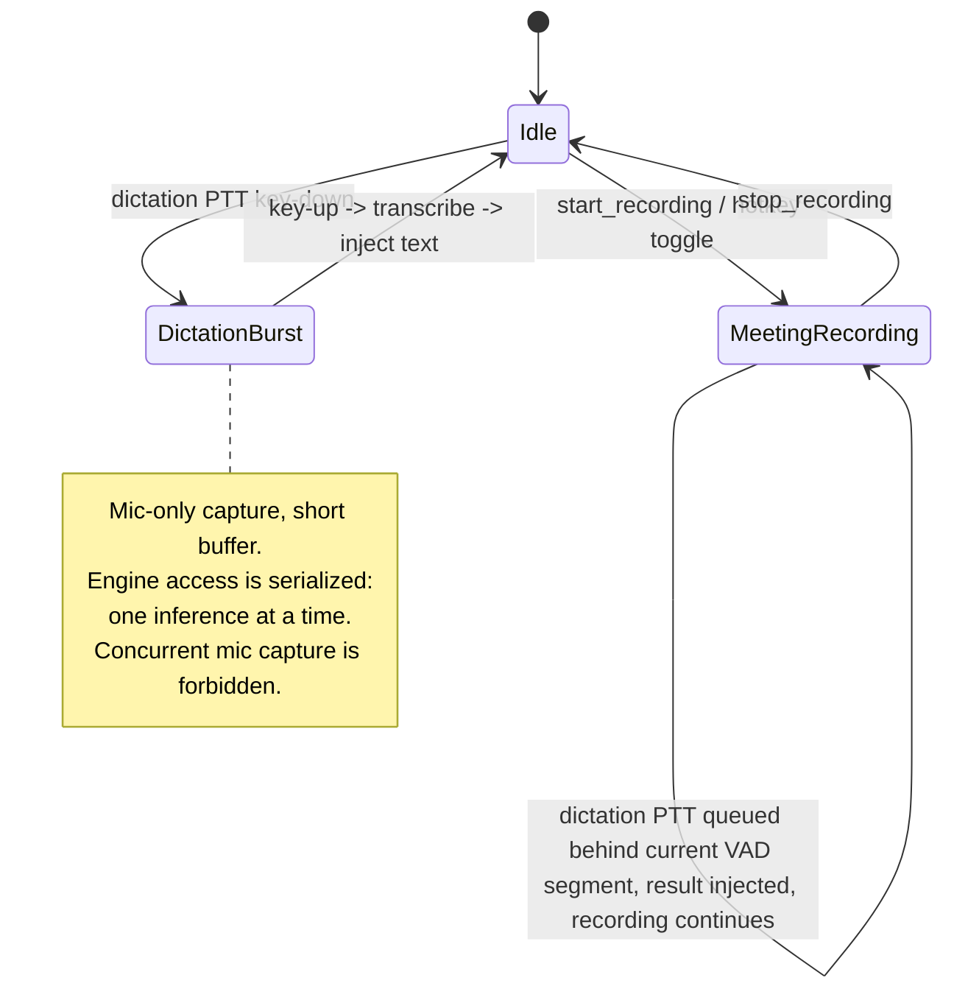
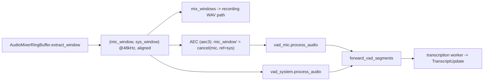
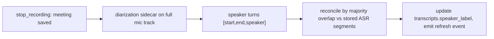

# Dual-mode dictation and prior-art feature expansion

## Summary

Bring five capabilities into muesly, adapted from three open-source speech apps (VoiceInk, OpenWhispr, Handy): type-safe Tauri bindings (specta), on-device speaker diarization, acoustic echo cancellation, push-to-talk dictation, and meeting auto-detection. The foundational decision — confirmed with the maintainer — is that muesly becomes **dual-mode**: a long-session meeting recorder **and** a burst push-to-talk dictation tool, sharing one cached transcription engine. macOS-specific pieces (text injection, app-focus detection) are first-class on macOS and degrade to graceful no-ops on Windows/Linux first.

---

## Problem Frame

muesly today is a meeting recorder only (north star: Granola). Four capabilities its peers ship are genuinely valuable and absent here: speakers in a multi-person room collapse into a single "Me" lane (no diarization); on loudspeakers the mic re-records the system audio and the transcript shows echo-duplicated lines (no AEC, noted in `TODOs.md:85`); there is no way to dictate text into another app; and the user must manually start recording when a call begins (`TODOs.md:37`). Separately, the IPC layer has ~110 hand-registered commands and 157 untyped `invoke()` call sites that can drift silently — a correctness/DX tax that grows with every feature below. The maintainer has also chosen to expand muesly's identity to include dictation, which turns previously out-of-scope features (text injection, per-context cleanup prompts) into committed work.

The dictation premise is a maintainer-driven product expansion, not a validated user request: it is in scope because the maintainer wants it (reasonably, for personal use and to close the gap with Handy/VoiceInk/OpenWhispr), and muesly's differentiator carries over — a fully local, privacy-first engine with no cloud round-trip. That premise is accepted, but it is a bet, not a settled product truth: dictation (active, repetitive, instant-feedback) is a different job from meeting capture (ambient, passive), and the two user populations may only partly overlap. The plan therefore keeps the dictation phase (D) cleanly separable so it can be cut or split without touching the meeting-assistant work (B, C, E). See the review note under Phased Delivery.

This is the second wave of the prior-art comparison. The first wave (custom vocabulary, idle model unload, global start/stop hotkey, resumable downloads) already shipped as `plans/016`–`plans/019`.

---

## Requirements

- R1. The frontend calls Rust commands through generated, type-checked bindings; a Rust signature change that breaks a call site fails `pnpm -C src-svelte check` rather than failing silently at runtime.
- R2. On loudspeakers, system audio bleeding into the mic is suppressed before transcription, materially reducing echo-duplicated transcript segments, without degrading the recorded WAV.
- R3. For in-room meetings, the transcript attributes speech to distinct speakers (beyond the existing mic/system "Me/Them" split), computed entirely on-device.
- R4. A user can hold a global hotkey, speak, release, and have the transcribed (optionally LLM-cleaned) text inserted into whatever application is focused — without a meeting recording in progress.
- R5. Dictation and meeting recording never run simultaneously; the shared transcription engine processes one request at a time with defined precedence, and the user is never left with two mic sessions fighting for the device.
- R6. When a known meeting app (Zoom/Teams/Meet) comes to the foreground, muesly offers to start recording; this is first-class on macOS and a clean no-op where unsupported.
- R7. Every new downloadable model (diarization) and new setting (dictation toggles, cleanup prompts, meeting-app list) follows muesly's existing download-progress and single-row settings patterns.
- R8. All new native integrations compile and run on macOS, Windows, and Linux; platform-only features are `#[cfg]`-gated and no-op cleanly off their home platform.

---

## Scope Boundaries

- Not changing the summarization pipeline, cloud providers, or meeting-notes UX.
- Not adding cloud transcription or cloud diarization — everything stays on-device (privacy is the product).
- Not building a full speaker-naming/enrollment system in this plan (diarization produces anonymous speaker labels like "Speaker 1"; naming them is deferred).
- Not copying any code from VoiceInk (GPLv3) — only ideas are reused; Handy and OpenWhispr are MIT and may be adapted as code with attribution.
- Not migrating all 157 `invoke()` call sites in one unit — specta adoption is incremental (see U1).

### Deferred to Follow-Up Work

- Per-speaker naming and cross-meeting speaker identity (voice fingerprint persistence): future iteration on top of U3–U5.
- Linux Wayland active-window detection (no standard protocol exists): U11 no-ops on Wayland; revisit if a portal API matures.
- A user-editable dictation accelerator capture widget: U10 ships a sensible default + enable toggle first, mirroring how `plans/018` deferred the same for the recording hotkey.

---

## Context & Research

### Relevant Code and Patterns

From repo research (paths repo-relative):

- **Audio pipeline:** `app/src-tauri/src/audio/pipeline.rs`. `AudioCapture::process_audio_data` runs per-device in the cpal callback (mono → 48kHz resample → mic-only enhancement → `AudioChunk`). `AudioPipeline::run()` (~lines 882–934) is where `AudioMixerRingBuffer::extract_window()` yields **time-aligned** `(mic_window, sys_window)` at 48kHz, then `mix_windows(...)` builds the recording mix and `vad_mic`/`vad_system` (`ContinuousVadProcessor`) produce `SpeechSegment`s on the transcription path. This is the seam for both AEC (operate on `mic_window` before VAD) and diarization (label segments in `forward_vad_segments`, ~lines 987–1027).
- **Speaker field end-to-end:** `DeviceType` → `"mic"`/`"system"` string in `audio/transcription/worker.rs` (`TranscriptUpdate.source`), saved as `TranscriptSegment.speaker` (`recording_commands/mod.rs:328`) into `transcripts.speaker TEXT` (`migrations/20260616000000_initial_schema.sql:39`). Recovery JSON in `audio/recording_saver.rs` + `audio/incremental_saver.rs` also carries `speaker`.
- **Recording lifecycle:** `app/src-tauri/src/audio/recording_commands/mod.rs` (`start_recording_with_devices_and_meeting`, `stop_recording`, `IS_RECORDING: AtomicBool`, `RECORDING_MANAGER`). Mic-only is already supported (`system_device_name: None`).
- **Hotkey + tray:** `app/src-tauri/src/tray.rs::toggle_recording_handler`; `lib.rs` global-shortcut plugin (~724–730), `RECORDING_SHORTCUT` const (678), `set_recording_shortcut_enabled` (681–698) — all added by `plans/018`.
- **Model download pattern (mirror for diarization):** `app/src-tauri/src/parakeet_engine/commands.rs` (`*_download_model` emitting `*-download-progress`/`-complete`/`-error`), shared `ModelStatus` in `transcription_models.rs`, frontend stores `app/src-svelte/src/lib/stores/onboarding.svelte.ts` and `ollama-download.svelte.ts`.
- **Settings pattern:** single-row `settings` table; `database/repositories/setting.rs` upsert helpers (`set_transcription_language`, `set_custom_vocabulary` are the exemplars); frontend `app/src-svelte/src/lib/stores/config.svelte.ts` (`$state` + `start()` load + setter, localStorage for instant-read booleans like `globalShortcutEnabled`).
- **Command/IPC surface (specta target):** `generate_handler!` in `lib.rs` (~110 commands); 157 `invoke()` calls; manual TS interfaces in `app/src-svelte/src/lib/services/config.ts`.
- **Conventions:** `anyhow::Result` internally, `Result<_, String>` at command boundaries; `perf_debug!` for hot paths; "microphone"/"system" naming; Tauri path APIs only. `cidre` and `sysinfo` are already dependencies (useful for U8/U11).

### Institutional Learnings

- None on disk — this repo has no `docs/solutions/`. The closest internal knowledge is `plans/016`–`019` (prior-art ports already shipped) and `docs/adr/0001-keychain-secret-storage.md`.

### External References

AEC / text-injection / app-detection research completed and is well-cited (2026):

- **AEC:** `aec3` (pure-Rust WebRTC AEC3 port, crates.io, updated Apr 2026) is the recommended primary — no C build deps, native 48kHz, discrete render/capture API matching muesly's aligned windows. Fallback: `webrtc-audio-processing` 2.1.0 (battle-tested but Meson/ninja build risk on Windows CI). AEC needs time-aligned near-end (mic) + far-end (system) at fixed 10ms frames (480 samples @ 48kHz) and an `initial_delay_ms` seed (~80–150ms, measure empirically).
- **Text injection:** `enigo` 0.6.1, but `enigo.text()` crashes inside a Tauri command on macOS (Tauri #6421). Recommended: write clipboard via `arboard` **dispatched to the macOS main thread** (NSPasteboard is not thread-safe; off-main writes segfault — plugins-workspace #3205), then synthesize Cmd/Ctrl+V via enigo. Offer multiple paste methods (Handy pattern). macOS needs Accessibility permission (`AXIsProcessTrustedWithOptions`, reachable via `cidre`). Linux/Wayland needs Handy's enigo-reconnect-and-retry pattern (Handy PR #1395).
- **App-focus detection:** macOS `NSWorkspaceDidActivateApplicationNotification` via `objc2-app-kit` (or `cidre`), match `NSRunningApplication.bundleIdentifier()`; Windows `wineventhook` + `sysinfo` (PID→name); Linux X11 poll `active-win-pos-rs` at ~1Hz, Wayland no-op.
- **Dual-mode architecture:** one engine, one inference at a time, mode state machine (Idle/MeetingRecording/DictationBurst); forbid concurrent mic capture; queue a dictation burst behind the current VAD segment when a meeting is recording.

specta / sherpa research completed (2026):

- **tauri-specta (U1):** pin `tauri-specta = "=2.0.0-rc.25"` (features `derive`, `typescript`), `specta = "=2.0.0-rc.25"` (feature `derive`), `specta-typescript = "0.0.12"` — exact `=` pins (RC series breaks across patches). Annotate commands `#[tauri::command]` then `#[specta::specta]` (order matters). Build `tauri_specta::Builder::<tauri::Wry>::new().commands(collect_commands![...]).events(collect_events![...])`, export under `#[cfg(debug_assertions)]` (and/or a `#[test]` for CI) to `app/src-svelte/src/bindings.ts`, and replace `generate_handler!` with `builder.invoke_handler()` plus `builder.mount_events(app)` in `setup`. `Result<_, String>` maps cleanly. **Generic `R: Runtime` commands must be monomorphized** in the macro (`start_recording::<tauri::Wry>`) — the most common migration error. Submodule paths (`analytics::commands::init_analytics`) work directly. Incremental adoption is supported: keep `generate_handler!` while annotating, swap at the end.
- **Diarization (U3/U4):** the `sherpa-rs` crate is **deprecated/archived**; use the official `sherpa-onnx = "1.13.3"` (Apache-2.0). **The ORT link conflict is real:** `sherpa-onnx-sys` statically links its own `onnxruntime`, and muesly's `ort` (Parakeet) links another (different ORT versions: sherpa bundles ~1.17–1.18, `ort` targets ~1.26). In-process linking will likely fail on macOS (duplicate symbols) or misroute on Linux. **Decision: run diarization in a sidecar process** mirroring `llama-helper` — no symbol conflict, matches muesly's architecture. API: `OfflineSpeakerDiarization` with pyannote-segmentation-3 (~7MB) + an English embedding model (`wespeaker_en_voxceleb_CAM++.onnx`, ~28MB); 16kHz mono f32 input (resample from 48k via the existing `rubato`); output `{start, end, speaker: i32}`, `sort_by_start_time()`, `num_clusters=0` auto-detect. Models are MIT/Apache, MIT-compatible.

---

## Key Technical Decisions

- **Adopt `tauri-specta` (=2.0.0-rc.25) incrementally, not big-bang (U1):** generate `bindings.ts` and migrate call sites module-by-module so the ~157 sites convert without one unreviewable diff. Keep `generate_handler!` working while commands are annotated; swap to `builder.invoke_handler()` only once all are annotated and compiling. Rationale: a single sweep across analytics/whisper/parakeet/api is high-risk; incremental keeps each PR reviewable and the app shippable throughout.
- **AEC library — verify `aec3` availability before treating it as primary (U2):** the earlier research's "crates.io" claim is unconfirmed; `aec3`/`aec3-rs` may be a **git-only** repo, which means a git-rev dependency (un-auditable by `cargo audit`, can vanish on force-push). The U2 spike must first confirm whether it is a published crate. If it is git-only or won't build on all three platforms, make the **published, battle-tested `webrtc-audio-processing` the primary** and treat `aec3` as the experiment, not the reverse. Either way, AEC operates on muesly's already-aligned 48kHz `(mic_window, sys_window)`.
- **AEC depends on a usable far-end reference (U2):** `TODOs.md:117` documents that the CoreAudio system tap captures *post-volume* audio, so at low output volume the far-end reference is near-silent and AEC cannot cancel (and may corrupt the mic). AEC effectiveness is gated on resolving that level issue (gain-normalize the far-end by output volume, or document that AEC needs reasonable system volume). Do not ship AEC as "on" until this is validated.
- **AEC applies to the transcription path only, never the recorded WAV (U2):** echo-cancel the `mic_window` copy that feeds `vad_mic`; leave `mix_windows`' recording output untouched so the saved audio remains faithful.
- **Diarization via `sherpa-onnx` (1.13.3) in a SIDECAR process, not in-process (U3):** `sherpa-onnx-sys` statically links its own ONNX Runtime, which collides with muesly's `ort` link (Parakeet) — likely a hard duplicate-symbol error on macOS. Running diarization as a sidecar binary (a new Cargo workspace member mirroring `llama-helper`) gives it its own process and symbol space, eliminating the conflict and matching muesly's existing sidecar pattern. The tradeoff (IPC of audio + results) is acceptable because diarization runs once post-recording, not in the live hot path. Diarize the **mic lane** (in-room speakers); the system lane stays "Them". (`sherpa-rs` is deprecated — do not use it.)
- **Diarization is opt-in and reconciled post-hoc (U4):** speaker turns from diarization are aligned to existing ASR segment timestamps; store labels in a new `transcripts.speaker_label` column (additive migration), leaving the existing `speaker` (mic/system) column intact for backward compatibility.
- **Text injection = clipboard + synthesized paste, not `enigo.text()` (U8):** avoids the Tauri #6421 macOS crash; `arboard` writes dispatched to the main thread; enigo only synthesizes the paste chord. Multiple paste methods are user-selectable.
- **One transcription engine, serialized, minimal mutual-exclusion (U6) — not a new state-machine abstraction:** start with a `DICTATION_ACTIVE: AtomicBool` mirroring the existing `IS_RECORDING`, with each path gating on the other's atomic, and serialize so exactly one inference runs at a time. This matches the existing code pattern and avoids a `mode.rs` abstraction that would have one consumer; promote to a named state machine only if a third mode appears.
- **Keep the engine warm for dictation (U6/U7):** the "same cached engine" assumption is currently false — `stop_recording` unloads the model and `plans/017`'s idle watcher unloads after 5 min, so a dictation burst after a meeting/idle would cold-load (multi-second). Decision: when dictation is enabled, skip the post-meeting unload and exempt the model from idle-unload; and the dictation path must reload synchronously (with a "preparing…" state) if the model is cold rather than promising an instant burst over a cold engine.
- **Dictation injection is clipboard-safe and window-targeted (U7/U8):** capture the focused window at key-up (reuse U11's frontmost-app machinery) and inject only into that window; save and restore the user's prior clipboard around the paste; inject the *cleaned* text when cleanup is on; never inject into a secure-input field; surface a real failure UX (permission, no-focused-field, injection-failed) instead of silent no-ops.
- **Native platform integrations are `#[cfg]`-gated with a no-op default (U8/U11):** macOS-first; Windows/Linux get real or no-op implementations behind the same Rust trait so the frontend sees one stable command/event surface.

---

## Open Questions

### Resolved During Planning

- *Should muesly become a dictation app?* — Yes (maintainer decision). Dual-mode is the foundational scope of this plan.
- *Where does AEC attach without corrupting recordings?* — On the transcription-path `mic_window` only, at `AudioPipeline::run()` before `vad_mic.process_audio`, after `mix_windows`.
- *How do dictation and meeting recording coexist?* — They don't run concurrently; serialized engine + mutual-exclusion atomics (U6), dictation queued behind the active VAD segment.
- *Does diarization need a new schema?* — Yes, an additive `speaker_label` column; the existing `speaker` (mic/system) stays.
- *Which specta version + setup for Tauri 2.6?* — `tauri-specta`/`specta` `=2.0.0-rc.25`, `specta-typescript` `0.0.12`; `builder.invoke_handler()` replaces `generate_handler!`; generic `R: Runtime` commands monomorphized in the macro; export via `#[cfg(debug_assertions)]` + a `#[test]`.
- *Does `sherpa-onnx` conflict with muesly's `ort` (Parakeet)?* — Yes, in-process (it statically links a second, different-version ONNX Runtime). Resolved by running diarization in a `diarization-helper` **sidecar**, so the conflict cannot occur. (`sherpa-rs` is deprecated; use `sherpa-onnx` 1.13.3.)
- *Can diarization run live in the pipeline?* — No. `OfflineSpeakerDiarization` clusters across the whole recording, so it runs **post-recording** on the full mic track (U4), not per VAD segment.

Resolved by the doc review (2026-06-18):
- *Mode coordination — state machine or atomic?* — Atomic (`DICTATION_ACTIVE` mirroring `IS_RECORDING`); a `mode.rs` state machine is over-abstracted for one consumer (U6).
- *Does the dictation engine stay warm?* — No, not by default; the plan now skips post-meeting unload + idle-exempts when dictation is enabled and reloads cold synchronously (U6/U7).
- *Where does dictated text go, safely?* — Into the window captured at key-up; clipboard saved/restored; cleaned (not raw) when cleanup is on; suppressed on secure-input fields (U7/U8).
- *AEC user toggle?* — Dropped; a correct AEC is a no-op on a silent reference, so the toggle guarded a hypothetical (U2).
- *Cleanup-preset storage?* — A dedicated `dictation_cleanup_presets` table, not a JSON blob in the settings row (U9).
- *Is the foreground-app watcher always on?* — No; it starts only when auto-detect is enabled and emits a minimized, non-persisted payload (U11).

### Deferred to Implementation

- **`aec3` availability + cross-platform build** (U2): confirm whether it is a published crate or git-only and whether it (or `webrtc-audio-processing`) builds on all three platforms — the spike picks the primary.
- **AEC far-end level fix** (U2): resolve/validate the `TODOs.md:117` post-volume tap issue before enabling AEC; decide gain-normalize-by-volume vs. document a volume floor.
- **Diarization sidecar go/no-go** (U3): **build/link = GO on macOS** (verified 2026-06-18: `sherpa-onnx` 1.13.3 + `sherpa-onnx-sys` compile and link cleanly as a standalone binary, so the separate-process design does sidestep the `ort` conflict). Still unverified headlessly: runtime diarization quality, which needs the ~35MB models downloaded and real meeting audio.
- **English vs multilingual embedding** (U3): choose the embedding model or accept + message the English-best limitation.
- **Dictation cleanup latency budget** (U9): measure the local model path against the ~2s budget; if it can't meet it, cleanup is async, never cloud.
- **Dictation interaction (hold vs toggle) and the in-progress/discoverability UI** (U7/U10): pick one interaction and the indicator surface with the design owner.
- **Empirical AEC `initial_delay_ms`** (U2): measure on real hardware; the 80–150ms range is a starting point.
- **Diarization↔ASR reconciliation precision** (U4): the overlap/assignment rule (majority-overlap is the starting point) plus `min_duration_on`/`min_duration_off` tuning, settled once real transcripts exist.

---

## High-Level Technical Design

> *This illustrates the intended approach and is directional guidance for review, not implementation specification. The implementing agent should treat it as context, not code to reproduce.*

Dual-mode behavior (conceptual). U6 implements this with two mutual-exclusion atomics (`IS_RECORDING`, `DICTATION_ACTIVE`), **not** a formal state machine. A dictation request during a meeting is processed inline (queued behind the current VAD segment, bounded wait) and the meeting continues — it does not enter a separate mode:

Live audio-pipeline seam — **U2 AEC only** (within `AudioPipeline::run()`). Diarization is NOT here; it is offline/post-recording (U4), shown separately below.

Offline diarization seam (U4), after `stop_recording` saves the meeting:

---

## Implementation Units

Grouped into five phases (see Phased Delivery). U-IDs are stable.

### U1. Adopt tauri-specta for type-safe IPC bindings

**Goal:** Generate a typed `bindings.ts` from Rust commands and migrate frontend call sites onto it incrementally, so command-contract drift becomes a compile-time error.

**Requirements:** R1

**Dependencies:** None (foundation; do first so later units add typed commands from the start)

**Files:**
- Modify: `app/src-tauri/Cargo.toml` (add `specta` + `tauri-specta` + `specta-typescript`), `app/src-tauri/src/lib.rs` (swap `generate_handler!` for the specta collector + export-on-build)
- Modify: return/argument structs across `app/src-tauri/src/**` to derive `specta::Type` (start with the ~25 distinct DTOs: `ModelConfig`, `TranscriptModelProps`, `ModelInfo`, `TranscriptUpdate`, `RecordingState`, etc.)
- Create: `app/src-svelte/src/lib/bindings.ts` (generated; checked in)
- Modify: one frontend module's call sites per migration step (begin with `app/src-svelte/src/lib/services/config.ts`)
- Test: `app/src-svelte` typecheck is the gate; add a Rust build test that the bindings export runs

**Approach:**
- Pin `tauri-specta = "=2.0.0-rc.25"` (features `derive`, `typescript`), `specta = "=2.0.0-rc.25"` (feature `derive`), `specta-typescript = "0.0.12"` — exact `=` pins.
- Annotate each command `#[tauri::command]` then `#[specta::specta]` (order matters). Build `tauri_specta::Builder::<tauri::Wry>::new().commands(collect_commands![...]).events(collect_events![...])`. Monomorphize every generic `R: Runtime` command in the macro (`start_recording::<tauri::Wry>`) — this is the most common migration error.
- Export `bindings.ts` under `#[cfg(debug_assertions)]` on startup AND via a `#[test]` so CI regenerates it without launching the app. Swap `generate_handler!` → `builder.invoke_handler()` and add `builder.mount_events(app)` in `setup` only once all commands are annotated and compiling.
- Keep `generate_handler!` behavior intact while annotating; migrate call sites module-by-module (start with `services/config.ts`); each step compiles and ships. Do not convert all 157 at once.
- Any boundary type that can't derive `specta::Type` (third-party without a specta feature) becomes a small mapping/DTO rather than serde gymnastics.

**Execution note:** Characterization-first — before migrating a module's call sites, confirm the generated signature matches the current manual type so the swap is behavior-preserving.

**Patterns to follow:** existing manual interfaces in `app/src-svelte/src/lib/services/config.ts` (the target shape the generated types must match).

**Test scenarios:**
- Happy path: a command with a struct return generates a matching TS type; calling it from the migrated module typechecks.
- Edge case: a command returning `Result<T, String>` maps to the expected TS error shape; a renamed Rust field breaks `pnpm -C src-svelte check` (the whole point).
- Integration: after migrating `config.ts`, the app still loads model/transcript config at runtime (no behavior change).

**Verification:** `pnpm -C src-svelte check` → 0 errors with generated bindings in use for at least the first migrated module; `cargo check --workspace` → 0; `bindings.ts` regenerates deterministically.

**Exit criterion (so adoption can't stall half-migrated):** U1 is "done" only when `builder.invoke_handler()` is the **sole** handler (no parallel `generate_handler!`) — i.e. all ~110 commands are annotated and compiling — and at least one full service module's call sites use the generated `commands.*`. Migrating the remaining ~157 call sites is explicit follow-up work, not an open-ended background task. If the full annotation sweep is too large to land in one go, scope U1 to "annotate + export `bindings.ts` + cut over the handler" and track call-site migration as a separate plan.

---

### U2. Acoustic echo cancellation on the transcription path

**Goal:** Suppress system-audio bleed in the mic signal before VAD/transcription, cutting echo-duplicated segments, without altering the recorded WAV.

**Requirements:** R2, R8

**Dependencies:** None (independent of U1; benefits from U1 only if it adds a command)

**Files:**
- Modify: `app/src-tauri/Cargo.toml` (add `aec3`, pinned)
- Create: `app/src-tauri/src/audio/echo_cancel.rs` (a thin wrapper: `EchoCanceller::process(mic: &mut [f32], reference: &[f32])`, 480-sample framing, delay seed)
- Modify: `app/src-tauri/src/audio/pipeline.rs` (`AudioPipeline::run()`: feed `sys_window` as render, echo-cancel a copy of `mic_window` that flows to `vad_mic`; leave `mix_windows` untouched)
- Test: `app/src-tauri/src/audio/echo_cancel.rs` unit tests

**Approach:**
- **Spike-first:** confirm whether `aec3` is a published crate or git-only, and that it (or the `webrtc-audio-processing` fallback) builds on macOS/Windows/Linux. Pick the primary based on the spike (prefer the published crate). STOP and report if neither builds cleanly.
- Far-end = system window (what was played); near-end = mic window. Both are already 48kHz and aligned by the ring buffer. Chunk to exactly 480 samples (10ms).
- **Far-end usability gate:** verify the system-tap level issue (`TODOs.md:117`) — if the captured system audio is post-volume and near-silent at low output, gain-normalize the far-end by the OS output volume, or gate AEC to "reasonable volume". AEC must not corrupt the mic when the reference is silent (the all-zero-reference passthrough test covers this).
- Seed `initial_delay_ms` from a constant (start ~120ms) exposed for later tuning; do not block on perfect calibration.
- No user-facing toggle for now — a correct AEC is a no-op on a silent/headphone reference, so the toggle would guard a hypothetical. Add a setting only if post-launch evidence shows AEC degrades some configuration (the version pin + `echo_cancel.rs` isolation make a later fix cheap).
- Recording path keeps the raw mix — AEC only mutates the transcription copy.

**Patterns to follow:** the existing per-window processing in `AudioPipeline::run()` and the mic-only enhancement chain in `AudioCapture::process_audio_data` (filters operate on owned buffers).

**Test scenarios:**
- Happy path: with a synthetic mic = speech + delayed copy of a known reference, AEC output has materially lower correlation with the reference than the input did.
- Edge case: reference shorter/longer than mic window, or all-zero reference (headphones, no system audio) → mic passes through unchanged, no panic.
- Edge case: window not a multiple of 480 samples → framing handles the remainder without dropping audio.
- Integration: a recorded WAV produced with AEC enabled is bit-for-bit the same as with AEC disabled (recording path untouched).

**Verification:** unit tests pass; `cargo check --workspace` → 0; manual: play system audio on speakers, record, confirm fewer/no echo-duplicated transcript lines vs a pre-change baseline.

---

### U3. Diarization engine module + downloadable model

**Goal:** Add a diarization **sidecar binary** (using `sherpa-onnx` 1.13.3) plus a thin in-process client that downloads the models on demand and turns recorded PCM into speaker-labeled time turns, reusing muesly's model-download and sidecar machinery.

**Requirements:** R3, R7, R8

**Dependencies:** None (the ORT-link conflict is resolved by the sidecar decision; no in-process `sherpa-onnx` link).

**Files:**
- Create: `diarization-helper/` (new Cargo workspace member, mirroring `llama-helper/`; `Cargo.toml` adds `sherpa-onnx = "1.13.3"`). The sidecar reads PCM/WAV + model paths and writes JSON speaker turns.
- Modify: root `Cargo.toml` (add `diarization-helper` to the workspace) and the build/bundle config so the sidecar binary ships (mirror how `llama-helper` is bundled).
- Create: `app/src-tauri/src/diarization/{mod.rs,client.rs,commands.rs}` — spawns/talks to the sidecar (mirror the `llama-helper` spawn/IPC), plus model download commands.
- Modify: `app/src-tauri/src/lib.rs` (register diarization commands; `set_models_directory` in `setup`)
- Create: `app/src-svelte/src/lib/stores/diarization-download.svelte.ts` (mirror `ollama-download.svelte.ts`)
- Test: sidecar pure parts + the client's reconciliation helpers (unit); a fixture-based diarization run if a small WAV fixture is feasible

**Approach:**
- **Sidecar, not in-process:** the diarization binary owns `sherpa-onnx` and its statically-linked ORT; the Tauri process keeps using `ort` for Parakeet. **IPC transport = stdin/stdout** (request/response), the same isolation `llama-helper` uses — **no network/loopback socket** is opened. The spawned binary should be the bundled, integrity-checked sidecar (verify it is the shipped artifact, not a same-named process).
- Models: pyannote-segmentation-3 (`model.onnx`, ~7MB) + `wespeaker_en_voxceleb_CAM++.onnx` (~28MB embedding). Download as one bundle (~35MB) via the Parakeet pattern (`diarization-model-download-progress`/`-complete`/`-error`, reuse `plans/019`'s disk-preflight + resumable download). **Verify a pinned SHA-256 for each downloaded model file and for the sidecar's first-build native archive** — `plans/019` does a size check, not a hash, so this is new and required (supply-chain: these run against all local audio).
- Sidecar API: receives 16kHz mono f32 PCM (the client resamples from 48k via the existing `rubato`), configures `OfflineSpeakerDiarization` with `num_clusters = 0` (auto-detect), returns `[{start, end, speaker}]` sorted by start time.
- **English-optimized:** the CAM++/VoxCeleb embedding is English-trained and will mislabel non-English in-room speakers (muesly is multilingual). Either pick a multilingual embedding model or message in onboarding/UI that diarization accuracy is best for English (see Open Questions). Silently-poor non-English diarization is worse than none.
- Keep diarization entirely optional — absent model means the feature is simply off.

**Execution note:** **Go/no-go gate (blocking, before any other U3 work):** build a minimal `diarization-helper` that links `sherpa-onnx` and runs the example diarization on a fixture, confirming it builds and links on macOS/Windows/Linux **independently** of the main app's `ort`, and that the bundled ORT versions do not clash at runtime. If the sidecar will not build/link/run on any target, STOP and report — do not start U4/U5.

**Patterns to follow:** `llama-helper/` (sidecar binary + workspace member + bundling + spawn/IPC), `app/src-tauri/src/parakeet_engine/commands.rs` (download/cancel/retry), `transcription_models.rs::ModelStatus`, `app/src-svelte/src/lib/stores/ollama-download.svelte.ts`.

**Test scenarios:**
- Happy path: given a short two-speaker PCM fixture, the engine returns ≥2 distinct speaker ids with plausible non-overlapping turns.
- Edge case: single-speaker audio → one speaker id; silence → empty turns, no panic.
- Error path: missing/corrupt model dir → typed error surfaced as `Result<_, String>` at the command boundary, mirroring Parakeet's corrupted-model handling.

**Verification:** `cargo check --workspace` → 0; engine unit tests pass; the model downloads and reports progress in the UI like Parakeet does.

---

### U4. Post-recording diarization of the mic lane + reconcile with ASR segments

**Goal:** After a recording stops, run offline diarization on the full mic track and back-fill anonymous speaker labels onto the stored mic transcript segments, without disturbing the existing mic/system attribution.

**Requirements:** R3, R7

**Dependencies:** U3

**Files:**
- Create: `app/src-tauri/migrations/<new-timestamp>_add_speaker_label.sql` (`ALTER TABLE transcripts ADD COLUMN speaker_label TEXT;`)
- Modify: `app/src-tauri/src/audio/recording_commands/mod.rs` (`stop_recording`: after the meeting is saved, if diarization is enabled, invoke the sidecar on the full mic audio and update labels) + `app/src-tauri/src/database/repositories/` transcript repo (an `update_speaker_labels` method + DTO field)
- Create: `app/src-tauri/src/diarization/reconcile.rs` (pure `assign_speaker(asr_segments, diar_turns) -> Vec<Option<label>>` by majority overlap)
- Test: `app/src-tauri/src/diarization/reconcile.rs` unit tests + a transcript-repo round-trip test

**Approach:**
- **Offline, post-recording — not live.** `sherpa-onnx`'s `OfflineSpeakerDiarization` clusters across the *whole* recording (it needs every embedding to assign speakers), so it cannot run per-VAD-segment in the live pipeline. Run it once after the recording, on the saved mic track. This is why diarization is a sidecar invoked post-hoc, not a step in `AudioPipeline::run()`.
- **Non-blocking sequencing (do NOT insert into the `stop_recording` shutdown chain):** `stop_recording` saves the meeting and returns as it does today; diarization then runs in a **separate async task** that writes `speaker_label`s and emits a refresh event. The meeting is navigable immediately; labels populate in place when they arrive (like live transcript streaming). A long meeting must not add minutes of apparent "hang" to stop. If the app quits mid-diarization, the run is abandoned (not queued) and labels simply stay NULL.
- Reconcile diarization turns with the stored mic ASR segment timestamps by majority overlap (each mic segment gets the speaker whose turn covers most of it). Leave `speaker` ("mic"/"system") untouched and additive-only; only `speaker_label` is written.
- System-lane segments keep `speaker_label = NULL` (they are "Them").
- Degrade gracefully: diarization off/unavailable, or the sidecar errors → `speaker_label` stays NULL and the UI falls back to today's mic/system rendering. A diarization failure must never block saving the meeting.

**Patterns to follow:** the existing speaker-field threading documented in repo research (`worker.rs` → `recording_commands/mod.rs:328` → `transcripts.speaker`); the additive-migration pattern from `plans/016`'s `customVocabulary` column.

**Test scenarios:**
- Happy path: two overlapping diarization turns + three ASR segments → each segment gets the majority-overlap speaker.
- Edge case: ASR segment with no diarization coverage → `speaker_label` NULL, segment still saved.
- Integration (DB round-trip): save a transcript with `speaker_label`s, reload, confirm labels persist and the existing `speaker` column is unchanged; a meeting recorded with diarization off saves NULL labels.

**Verification:** migration applies in the in-memory test pool; reconciliation + round-trip tests pass; `cargo test --workspace` shows only the known `test_checkpoint_creation` failure.

---

### U5. Diarization UI and model management

**Goal:** Surface speaker labels in the transcript view and let users download/enable the diarization model from settings/onboarding.

**Requirements:** R3, R7

**Dependencies:** U4 (labels must exist), benefits from U1 (typed `invoke`)

**Files:**
- Modify: the transcript view component(s) under `app/src-svelte/src/lib/components/` (render `speaker_label` when present; fall back to mic/system)
- Modify: a settings component under `app/src-svelte/src/lib/components/` (download/enable diarization; reuse the model-card pattern) and `config.svelte.ts` (a `diarizationEnabled` setting following `globalShortcutEnabled`)
- Test: `pnpm -C src-svelte check`

**Approach:**
- **Rendering rule (explicit, so a third layout isn't invented):** mic-lane speakers stay left-aligned (like "Them" today); each anonymous speaker gets a distinct paper-theme tint token (not the "Me" accent, not the single "Them" gray) plus a small text label ("Speaker 1") above the bubble, Granola-style. System lane unchanged.
- **Single-speaker fallback:** if diarization finds one speaker, suppress the label and render plain mic styling (identical to diarization-off) — no redundant "Speaker 1" on every bubble.
- **Labeling state + live update:** while the post-recording sidecar runs, the meeting is open and readable with current mic/system rendering; a small "Identifying speakers…" indicator in the transcript header clears when labels arrive and they update in place (silent update, no flash). Non-blocking; navigable throughout.
- Model management mirrors the Parakeet/Whisper model cards. Set expectations in copy that labels are anonymous ("Speaker 1/2") until a future naming feature.

**Patterns to follow:** existing transcript rendering (`VirtualizedTranscriptView`), `ModelCard.svelte`/`ParakeetModelCard.svelte`, `config.svelte.ts` setter pattern.

**Test scenarios:** `Test expectation: none -- presentational + settings wiring; covered by typecheck and manual QA.` (No new behavioral logic beyond the store setter, which mirrors an existing tested pattern.)

**Verification:** `pnpm -C src-svelte check` → 0 errors; manual: a two-speaker recording shows distinct labels; toggling diarization off reverts to mic/system rendering.

---

### U6. Mutual exclusion between dictation and meeting recording + serialized, warm engine

**Goal:** Ensure dictation and meeting recording never run at once (no two mic sessions, one inference at a time), and that the transcription model stays warm enough for a dictation burst — using the existing atomic-flag pattern, not a new state-machine abstraction.

**Requirements:** R5

**Dependencies:** None (precedes U7; the dictation path depends on it)

**Files:**
- Modify: `app/src-tauri/src/audio/recording_commands/mod.rs` (add `DICTATION_ACTIVE: AtomicBool` beside `IS_RECORDING`; gate `start_recording*` on `!DICTATION_ACTIVE` and the dictation start on `!IS_RECORDING`; a pure `can_start(this_active, other_active) -> bool` helper for testing)
- Modify: the engine access point to serialize inference (one in-flight at a time); `stop_recording` to skip model unload when dictation is enabled; `app/src-tauri/src/model_idle.rs` (`plans/017`) to exempt the engine from idle-unload while dictation is enabled
- Test: `recording_commands` mutual-exclusion unit tests

**Approach:**
- Mirror `IS_RECORDING`: a second `AtomicBool` for dictation, with cross-checks so each mode rejects start while the other is active. No `mode.rs`, no three-state enum — that abstraction has one consumer today.
- Serialize inference behind the existing engine mutex; a dictation burst requested during a meeting is queued and processed after the current VAD segment finishes (do not interrupt mid-inference). **Bound the wait:** if the queued burst can't start within a short ceiling (a long meeting VAD segment can be many seconds), cancel it and tell the user to retry rather than injecting stale text late (see U7 UX).
- **Warm engine:** when dictation is enabled, `stop_recording` does not unload the model and the idle watcher skips it; the dictation path reloads synchronously (with a "preparing…" state) if the model is cold. Do not assume a warm engine.
- Keep the change additive: meeting recording behaves exactly as today when no dictation occurs.

**Patterns to follow:** the existing `IS_RECORDING: AtomicBool` usage; the `model_idle.rs` pure-decision-fn + unit-test pattern from `plans/017`.

**Test scenarios:**
- Happy path (`can_start`): start meeting when neither active → allowed; start dictation when neither active → allowed.
- Edge case: `start_recording` while `DICTATION_ACTIVE` → rejected with a clear error; dictation start while `IS_RECORDING` → allowed but queued (not a second mic session).
- Edge case: dictation queued behind a long meeting VAD segment that exceeds the wait ceiling → the burst is cancelled with a "try again" signal, not injected late.
- Edge case: dictation burst when the model was unloaded (post-meeting/idle) → the path reloads the model first; no inference runs against a `None` engine.

**Verification:** mode unit tests pass; existing recording tests still pass; `cargo check --workspace` → 0.

---

### U7. Dictation capture and burst transcription

**Goal:** Add `start_dictation`/`stop_dictation` that capture mic-only, transcribe the burst, and emit the text — without the meeting save/teardown path.

**Requirements:** R4, R5

**Dependencies:** U6

**Files:**
- Modify: `app/src-tauri/src/lib.rs` (register `start_dictation`/`stop_dictation`; or a new `dictation/commands.rs`)
- Create: `app/src-tauri/src/dictation/mod.rs` (burst lifecycle reusing `RecordingManager` mic-only, short/zero VAD latency, emit `dictation-complete` with the transcript)
- Modify: `app/src-tauri/src/audio/recording_commands/mod.rs` if shared helpers are extracted
- Test: dictation lifecycle unit/integration test (mic-only path, no DB write)

**Approach:**
- Reuse `RecordingManager` with `system_device_name: None`; skip `save_recording_only` and the 10-minute join — a dictation burst is short (key-down to key-up).
- **Capture the frontmost window/app at key-up** (via U11's machinery) and carry it on the burst, so U8 injects into the originally-targeted window, not whatever is focused seconds later.
- On stop, reload the model first if it is cold (U6), run one inference through the serialized engine (queued if a meeting is active per U6), and emit `dictation-complete` (carrying the target-window handle) rather than persisting a meeting.
- **In-progress feedback:** show a clear indicator while the key is held (recording) and between key-up and injection (transcribing) — a small floating indicator or tray badge; decide reuse of `StatusOverlays`/tray with the design owner. Resolve the hold-vs-toggle interaction explicitly (the plan currently says "key-down/up, or toggle" — pick one for v1).
- Same cached Whisper/Parakeet engine, but treated as possibly-cold per U6 — no assumption of warmth.

**Dependencies (revised):** U6, **U11** (window capture at key-up).

**Patterns to follow:** `start_recording_with_devices_and_meeting` (mic-only is already wired), the event-emit pattern (`app.emit`), `plans/018`'s reuse of `toggle_recording_handler`.

**Test scenarios:**
- Happy path: a short mic buffer in → `dictation-complete` carries the transcript; no meeting row is written.
- Edge case: empty/sub-threshold buffer → emits empty/no-op result, no panic, mode returns to Idle.
- Integration: dictation requested during a meeting → meeting transcription is uninterrupted, dictation result returns after the current segment, mode bookkeeping is correct.

**Verification:** dictation path returns text without creating a meeting; `cargo test --workspace` clean except the known failure.

---

### U8. Cross-platform text injection

**Goal:** Insert dictated text into the focused application via clipboard + synthesized paste, with macOS permissions handled and graceful behavior on Linux/Wayland.

**Requirements:** R4, R8

**Dependencies:** U7 (consumes `dictation-complete`), U11 (frontmost-app capture for window targeting)

**Files:**
- Modify: `app/src-tauri/Cargo.toml` (add `enigo`, `arboard`; `cidre` already present for AX permission)
- Create: `app/src-tauri/src/dictation/inject.rs` (a trait `TextInjector` with `#[cfg]` impls; clipboard write on macOS dispatched to main thread; paste-method enum)
- Modify: `app/src-tauri/src/lib.rs` (a `inject_text`/permission-check command if invoked from the frontend) and wiring from the `dictation-complete` handler
- Test: pure parts (paste-method selection, permission-state mapping) unit-tested; injection itself is manual

**Approach:**
- **Clipboard save/restore:** snapshot the user's current clipboard, write the dictated text, synthesize paste, then restore the original clipboard immediately. Never leave dictated text sitting in the clipboard (history managers/iCloud sync would capture it).
- **Inject cleaned, not raw:** when a cleanup preset is active (U9), the injected content is the cleaned text; raw transcript is never injected when cleanup is on.
- **Target the captured window:** inject into the window captured at key-up (from U7). If the focused app changed since key-up, do NOT inject blindly — hold and inject when the original window regains focus, or discard with a toast. Define this as the explicit fallback.
- **Secure input:** detect secure-input fields (macOS `NSSecureTextField` / IsSecureEventInputEnabled) and suppress injection there (or clipboard-only with a toast); never auto-paste into a password field.
- macOS: `arboard` write dispatched to the **main thread** (NSPasteboard is not thread-safe), then enigo synthesizes Cmd+V. Do **not** use `enigo.text()` (Tauri #6421 crash). Check `AXIsProcessTrustedWithOptions` (via `cidre`) at **dictation-enable time** (lazy first-use), not at inject time; do not register the dictation hotkey until granted.
- **One paste method + silent fallback**, not a user-facing selector: try Cmd/Ctrl+V; if it fails, fall back automatically (the Handy reconnect-and-retry-once wrapper, PR #1395, on Linux/Wayland). Add a user-visible picker only if real paste failures are reported.
- **Failure UX:** permission denied → toast/modal with an "Open Accessibility Settings" action (reuse `PermissionWarning.svelte`'s `openSettings()` pattern); injection failed → toast; no focused text field → clipboard-only with a toast explaining nothing was pasted.

**Execution note:** Spike the macOS clipboard-on-main-thread dispatch and the enigo paste in isolation before wiring it to dictation — the thread-safety and #6421 pitfalls are the real risk.

**Patterns to follow:** Handy's `clipboard.rs::paste` reconnect wrapper (MIT, adaptable); muesly's existing `#[cfg(target_os = ...)]` blocks in `audio/permissions.rs`.

**Test scenarios:**
- Happy path (unit): selecting paste-method "Ctrl+Shift+V" maps to the correct synthesized chord per platform.
- Edge case: macOS Accessibility not granted → returns a typed "permission required" result, no crash, no silent no-op.
- Error path: injection fails once (stale Wayland session) → reconnect-and-retry path engages; a second failure returns an error.
- Integration: manual — dictate into a text field in another app and confirm the text lands.

**Verification:** `cargo check --workspace` → 0 on all three platforms; unit tests for the pure parts pass; manual injection works on macOS with permission granted.

---

### U9. Per-context LLM cleanup prompts for dictation

**Goal:** Optionally clean up dictated text (disfluencies, casing, formatting) via the local LLM before injection, with user-selectable cleanup presets.

**Requirements:** R4

**Dependencies:** U7, U8 (cleanup output feeds injection; cannot be demonstrated end-to-end without U8)

**Files:**
- Modify: `app/src-tauri/src/summary/` (reuse the existing provider/prompt machinery for a short "clean this dictation" call)
- Create: `app/src-tauri/migrations/<new-timestamp>_add_dictation_cleanup_presets.sql` — a **dedicated `dictation_cleanup_presets` table** (id, name, prompt, display_order, is_default) seeded with the built-in presets, plus a `dictationCleanupPreset TEXT` (active-preset name) column on the single `settings` row. A user-editable *list of records* does not belong in a single JSON blob in the settings row.
- Modify: `app/src-svelte/src/lib/components/` settings + `config.svelte.ts`
- Test: prompt-construction unit test + a presets-table round-trip test

**Approach:**
- Default preset is **"Raw" (no cleanup), and it is the shipped default** so dictation is instant out of the box — the "Raw" path makes no LLM call at all.
- Cleanup is opt-in per the active preset. **Latency budget:** an LLM cleanup must complete within ~2s for a short dictation on target hardware; the local llama-helper sidecar (Qwen/Gemma GGUF) is not low-latency, so if it cannot meet the budget, cleanup runs visibly async (text injected raw first, or a "cleaning…" state) rather than blocking the burst — never a cloud call (privacy). Decide the model path against a measured budget, not "later".
- Built-in presets seeded by the migration: "Raw", "Polish", "Email".

**Patterns to follow:** `customVocabulary` JSON-in-settings column + `set_custom_vocabulary` repo helper; the summary prompt-builder.

**Test scenarios:**
- Happy path: "Polish" preset wraps the dictated text in the expected prompt; "Raw" returns text unchanged with no LLM call.
- Edge case: empty preset list → defaults applied; malformed JSON in the column → falls back to defaults, no crash.
- Integration (round-trip): save presets, reload, confirm persistence without nulling sibling settings.

**Verification:** unit + round-trip tests pass; "Raw" dictation performs no LLM call (fast path verified).

---

### U10. Dictation hotkey and settings/UI

**Goal:** A dedicated push-to-talk dictation hotkey (distinct from the recording toggle) plus settings to enable dictation, choose paste method, and pick a cleanup preset.

**Requirements:** R4

**Dependencies:** U7, U8, U9; benefits from U1

**Files:**
- Modify: `app/src-tauri/src/lib.rs` (register a second global shortcut for dictation PTT; a `set_dictation_shortcut_enabled` command mirroring `set_recording_shortcut_enabled`)
- Modify: `app/src-svelte/src/lib/components/RecordingSettings.svelte` (or a new DictationSettings) + `config.svelte.ts`
- Test: `pnpm -C src-svelte check`

**Approach:**
- Reuse the `plans/018` global-shortcut wiring; register a separate accelerator (default distinct from `CmdOrCtrl+Shift+R`) whose handler drives `start_dictation`/`stop_dictation`. Pick **one** interaction for v1 (hold-to-talk OR toggle), not both.
- Settings: dictation enabled (default off — opt-in; enabling triggers the lazy Accessibility-permission request from U8), and an active-cleanup-preset picker (dropdown/radio over U9's presets). **No paste-method selector** — U8 uses one method + silent fallback.
- **Dual-mode discoverability:** the user must be able to tell which mode is active. Define a persistent affordance — e.g. a tray badge / status indicator distinct from the meeting-recording indicator — and decide whether dictated text appears in the transcript view or only in the target app (recommend: target app only; dictation is not a meeting). The existing `RecordingStatusBar`/tray cover meeting recording only today; extend or add a dictation indicator.

**Patterns to follow:** `plans/018`'s `set_recording_shortcut_enabled` + the `globalShortcutEnabled` store/setter; the existing settings toggles.

**Test scenarios:** `Test expectation: none -- hotkey registration + settings wiring mirror plans/018; covered by typecheck and manual QA.`

**Verification:** `pnpm -C src-svelte check` → 0; manual: the dictation hotkey triggers a burst and injects text; disabling it unregisters the shortcut.

---

### U11. Frontmost-app watcher (meeting auto-detection backend)

**Goal:** Emit a `frontmost-app-changed` event when the foreground app changes, identifying it by bundle id / process name, first-class on macOS and graceful elsewhere.

**Requirements:** R6, R8

**Dependencies:** None (isolated)

**Files:**
- Create: `app/src-tauri/src/app_focus/mod.rs` (a trait + `#[cfg]` impls: macOS NSWorkspace via `objc2-app-kit`/`cidre`; Windows `wineventhook` + `sysinfo`; Linux X11 poll via `active-win-pos-rs`, Wayland no-op)
- Modify: `app/src-tauri/Cargo.toml` (add the per-platform deps behind `[target.'cfg(...)'.dependencies]`); `app/src-tauri/src/lib.rs` (start/stop the watcher on the auto-detect toggle — NOT unconditionally in `setup`)
- Test: pure parts (bundle-id/process-name → known-meeting-app matching) unit-tested

**Approach:**
- **Two distinct capabilities, both privacy-minimized:**
  - A **one-shot `current_frontmost_app()`** query (used by U7/U8 to capture the dictation target window at key-up). User-initiated, momentary, not a monitor.
  - A **continuous watcher** for meeting auto-detection. It is started **only when auto-detect is enabled** (U12), never unconditionally in `setup` — continuously observing which app is frontmost is behaviorally sensitive even locally.
- **Minimize the payload:** the watcher emits only what the match check needs — a matched-app name or a boolean match against the user's meeting-app list — not a full system app-switch stream. Never persist or log the foreground-app history anywhere.
- macOS: observe `NSWorkspaceDidActivateApplicationNotification` on the main run loop (`cidre` available); read `NSRunningApplication.bundleIdentifier()`.
- Windows: `EVENT_SYSTEM_FOREGROUND` hook → PID → `sysinfo` name.
- Linux: X11 poll ~1Hz; Wayland no-op (documented).
- One stable event + a pure matcher so the frontend is platform-agnostic.

**Execution note:** macOS-first. Land the trait + macOS impl + no-op fallbacks together so the build is green on all platforms even before Windows/Linux impls are fleshed out.

**Patterns to follow:** `audio/permissions.rs` `#[cfg(target_os = ...)]` structure; `sysinfo` already used in `plans/019`'s `disk.rs`.

**Test scenarios:**
- Happy path (unit): bundle id `us.zoom.xos` / process `Zoom.exe` matches the meeting-app set; an unrelated app does not.
- Edge case: missing bundle id / unknown process → no match, no panic.
- Integration: manual — focusing Zoom emits `frontmost-app-changed` with the right identifier on macOS; Wayland is a clean no-op.

**Verification:** `cargo check --workspace` → 0 on all platforms; matcher unit tests pass; manual macOS focus test emits the event.

---

### U12. Meeting auto-detection prompt (frontend)

**Goal:** When a configured meeting app comes to the foreground and no recording is active, prompt the user to start recording; let users manage the meeting-app list.

**Requirements:** R6

**Dependencies:** U11; benefits from U1

**Files:**
- Modify: `app/src-svelte/src/routes/+layout.svelte` (listen for `frontmost-app-changed`) and a small prompt component under `app/src-svelte/src/lib/components/`
- Modify: `config.svelte.ts` + a settings component (the meeting-app identifier list + an "auto-detect enabled" toggle)
- Test: `pnpm -C src-svelte check`

**Approach:**
- Enabling auto-detect **starts** U11's watcher; disabling stops it (the watcher is not on by default).
- On a match, show a **toast with an action button** (reuse the `system-audio-permission-missing` toast pattern in `+layout.svelte`, which already uses `action: { label, onClick }`) that auto-dismisses after ~10–12s (the default 3s toast is too short to switch apps and click). The action reuses the existing start-recording path.
- **No repeat spam:** trigger only when the meeting app newly comes to focus after not being focused for >N seconds (so alt-tabbing during a call doesn't fire repeatedly); honor "already recording"; a "don't ask again this session" affordance stored in a reactive store (not DB), reset on app launch.
- Default meeting-app list (Zoom/Teams/Meet) editable in settings; auto-detect off by default (opt-in).

**Patterns to follow:** `+layout.svelte` Tauri `listen` blocks; the toast/prompt components already in the shell.

**Test scenarios:** `Test expectation: none -- event listener + prompt UI; covered by typecheck and manual QA.`

**Verification:** `pnpm -C src-svelte check` → 0; manual: focusing a configured app while idle shows the prompt; while recording, no prompt.

---

## System-Wide Impact

- **Interaction graph:** the audio pipeline (`AudioPipeline::run`, `forward_vad_segments`), the transcription worker, the recording-command lifecycle, the global-shortcut handler, the tray, and the frontend layout listeners are all touched. The mutual-exclusion atomics (U6) are the new coordination point between meeting and dictation.
- **Error propagation:** all new native integrations return `anyhow::Result` internally and `Result<_, String>` at command boundaries; permission/availability failures surface as typed results, never silent no-ops (especially macOS Accessibility for U8).
- **State lifecycle risks:** dictation must not leave `IS_RECORDING`/mode in a stuck state on early return (mirror `plans/008`); diarization labels must be additive (existing `speaker` column untouched); AEC must not mutate the recording path.
- **API surface parity:** specta (U1) changes how every command is typed on the frontend — migrate incrementally and keep `bindings.ts` in sync with the Rust collector.
- **Integration coverage:** the dictation-during-meeting queueing (U6/U7) and the diarization↔ASR reconciliation (U4) are the cross-layer behaviors unit tests alone won't fully prove — call them out for manual QA.
- **Unchanged invariants:** the recorded WAV (U2 leaves it raw), the existing mic/system "Me/Them" attribution (U4 is additive), and meeting-recording behavior when no dictation occurs (U6 additive) must all be preserved.

---

## Risks & Dependencies

| Risk | Mitigation |
|------|------------|
| `aec3` API is "in flux" (work-in-progress crate) | Pin the version; isolate behind `echo_cancel.rs` so a bump touches one file; `webrtc-audio-processing` documented as fallback |
| sherpa-onnx statically links a second ONNX Runtime, colliding with muesly's `ort` (Parakeet) in-process | Resolved by isolating diarization in the `diarization-helper` **sidecar** (separate process + symbol space). Residual: the sidecar build + its first-build native download — spike-validate per platform (U3) and pre-cache `SHERPA_ONNX_LIB_DIR` in CI |
| Offline diarization adds post-recording latency on long meetings | It runs once after stop, off the hot path, and never blocks the meeting save (U4); surface a "labeling speakers…" state |
| `enigo.text()` crashes in Tauri on macOS (#6421) | Use clipboard + synthesized paste; never call `enigo.text()`; spike injection in isolation (U8) |
| `arboard` off-main-thread write segfaults on macOS (NSPasteboard) | Dispatch clipboard writes to the main thread (U8) |
| specta migration across 157 sites is large and risky | Incremental, module-by-module; each step compiles and ships (U1) |
| Two mic sessions / two inferences contend | `DICTATION_ACTIVE`/`IS_RECORDING` mutual-exclusion forbids concurrent capture; engine access serialized; dictation queued behind the active segment with a bounded wait (U6) |
| "Warm cached engine" assumption is false (`stop_recording` unloads; `plans/017` idle-unloads at 5 min) | When dictation enabled, skip the post-meeting unload + exempt the engine from idle-unload; dictation reloads a cold model synchronously with a "preparing…" state (U6/U7) |
| AEC far-end reference too quiet to cancel against (`TODOs.md:117` post-volume tap) | Gain-normalize the far-end by output volume or gate AEC to reasonable volume; do not ship AEC "on" until validated (U2) |
| `aec3` may be git-only, not a published crate (un-auditable git-rev dep) | U2 spike confirms availability first; if git-only or it won't build cross-platform, make the published `webrtc-audio-processing` primary (U2) |
| Dictated text injected into the wrong window (focus changed during transcription latency) | Capture the target window at key-up and inject only there; hold-for-refocus or discard if focus moved (U7/U8) |
| Dictated text leaks via clipboard history/sync | Save and restore the user's prior clipboard around the paste; never leave dictated text in the clipboard; suppress on secure-input fields (U8) |
| Supply-chain: first-build native archive + ~35MB model downloads | SHA-256 verify each file against a pinned hash before use — `plans/019` only size-checks (U3) |
| English-only embedding mislabels non-English in-room speakers (muesly is multilingual) | Pick a multilingual embedding or clearly message the English-best limitation (U3) |
| Foreground-app monitoring is behaviorally sensitive even locally | Watcher runs only when auto-detect is enabled (not in `setup`); minimized, non-persisted, match-only payload (U11) |
| Linux Wayland active-window detection unsupported | Documented no-op (U11); X11 polling where available |
| `tauri-specta`/`specta` RC (2.0.0-rc.25) | **CONFIRMED BLOCKER (2026-06-18):** `specta` rc.25 fails to build on stable Rust 1.92 — `error[E0658]: use of unstable library feature 'debug_closure_helpers'` (nightly-only). rc.25 is the only tauri-2-compatible line and the latest published, so **U1 is BLOCKED** until a stable-compatible `specta`/`tauri-specta` release ships (or the project adopts nightly Rust). Deps were added and reverted; tree is green. Pin all three with `=` once unblocked. |

---

## Documentation / Operational Notes

- Update `docs/architecture.md` (new `diarization/`, `dictation/`, `app_focus/`, `echo_cancel` modules; the dual-mode state machine) and `CLAUDE.md` "Gotchas" (macOS Accessibility permission for dictation; AEC is transcription-path-only).
- macOS dictation needs the **Accessibility** TCC permission (separate from the existing System Audio permission) — onboarding should explain it.
- New downloadable diarization model adds first-run download UX; reuse the existing model-download onboarding.
- Migrations target **different tables**: `ALTER TABLE transcripts ADD COLUMN speaker_label TEXT` (U4) and the dictation cleanup-preset storage (U9) — both additive/nullable, both follow the `plans/016` migration-timestamp rule (newer than all existing). Note: U9's preset *storage shape* (JSON-in-`settings` vs a dedicated `dictation_cleanup_presets` table) is an open review item — see Open Questions.

---

## Alternative Approaches Considered

- **`webrtc-audio-processing` for AEC instead of `aec3`:** more battle-tested but adds a Meson/ninja/abseil native build chain that complicates signed cross-platform CI; chosen as fallback, not default.
- **Big-bang specta migration:** convert all 157 call sites at once — rejected as an unreviewable, ship-blocking diff; incremental chosen.
- **Separate process for dictation (OpenWhispr's model):** avoids engine contention but adds process-startup latency and IPC complexity; rejected in favor of one serialized engine with a mode state machine, which fits muesly's single-process architecture.
- **Reusing the `speaker` column for diarization ids:** rejected — it would overload the mic/system meaning and break existing rendering; an additive `speaker_label` column is safer.

---

## Phased Delivery

Each phase has a minimum shippable outcome and is independently reviewable; phases can be cut or slipped without breaking the others.

- **Phase A — Foundation (U1):** specta. *Ships when:* `builder.invoke_handler()` is the sole handler and one service module uses generated bindings. Internal DX, no user-visible change; highest review surface of any single unit.
- **Phase B — Audio quality (U2):** AEC. *Ships when:* loudspeaker recordings show materially fewer echo-duplicated transcript lines and the recorded WAV is unchanged. Isolated; two files + a wrapper; no schema/UI.
- **Phase C — Diarization (U3→U4→U5):** *Ships when:* a two-speaker meeting renders "Speaker 1 / Speaker 2" in the transcript. Gated by the U3 sidecar go/no-go spike.
- **Phase D — Dual-mode dictation (U6→U7→U8→U9→U10):** *Ships when:* the dictation hotkey transcribes a burst and injects it into the focused window, safely (clipboard restored, right window, permission handled). U6 mutual-exclusion gates the rest; injection (U8) and cleanup (U9) before the hotkey/UX (U10).
- **Phase E — Auto-detection (U11→U12):** *Ships when:* focusing a configured meeting app while idle shows a start-recording prompt. Most isolated.

**Recommended sequencing & split (doc-review):** these are five independently-shippable workstreams; treat each phase as its own PR (and ideally its own plan file — this document is the umbrella). **Smallest valuable first increment = Phase B (AEC).** Phase A (specta) is a useful prerequisite but delivers no user-visible value and carries the most review risk — do it deliberately, not as a blocker. **Phase D (dictation) is the riskiest and the product-identity bet** — it is the strongest candidate to split into its own plan and to defer until B/C land, per the premise caveat in the Problem Frame.

Dependency notes: B, C, and E are mutually independent and can interleave. D depends on its own U6 foundation **and now on E (U11)** — U7/U8 reuse U11's frontmost-app capture to target the dictation window, so the one-shot `current_frontmost_app()` from U11 must exist before U7/U8 (the continuous watcher does not). U1 is a soft prerequisite for the frontend parts of every phase (typed commands) but hard-blocks none.

---

## Sources & References

- Prior-art ports already shipped: `plans/016`–`plans/019` and `plans/README.md`.
- muesly architecture: `docs/architecture.md`; conventions in `CLAUDE.md`.
- AEC: aec3 (crates.io / RubyBit/aec3-rs), webrtc-audio-processing (tonarino), sonora (dignifiedquire).
- Text injection: enigo (enigo-rs), arboard (1Password), Tauri #6421, plugins-workspace #3205, Handy PR #1395.
- App-focus: objc2-app-kit NSWorkspace, wineventhook-rs, active-win-pos-rs / x-win.
- Diarization: `sherpa-onnx` 1.13.3 (k2-fsa, Apache-2.0; `sherpa-rs` is deprecated). Models: pyannote-segmentation-3 (MIT) + `wespeaker_en_voxceleb_CAM++.onnx` (Apache-2.0). Offline diarization example: k2-fsa/sherpa-onnx `rust-api-examples/examples/offline_speaker_diarization.rs`; linking notes: ort.pyke.io/setup/linking + sherpa-onnx-sys `build.rs`.
- specta: `tauri-specta`/`specta` `=2.0.0-rc.25`, `specta-typescript` `0.0.12` (specta-rs/tauri-specta; docs.rs/tauri-specta).
