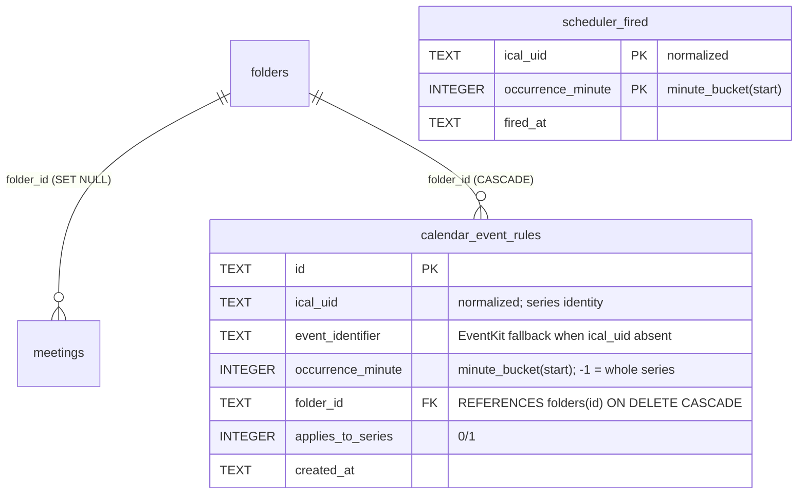

# ✨ Calendar-driven recording, meeting notifications, and pre-assign-to-folder

## Enhancement summary

**Deepened on:** 2026-07-07 (research: 3 subsystem maps + learnings, 8-agent review panel:
adversarial, feasibility, scope, design-lens, security-lens, coherence, spec-flow, scheduling
research).

### Key improvements folded in
1. **Two shippable slices.** Slice A (home **Start** button + **pre-assign to folder**) has *no*
   dependency on the scheduler and ships first; Slice B (scheduler + auto-start + auto-join +
   start notifications) follows. Concentrates the risk in the separable second slice.
2. **Real recurrence signal.** The window-count `is_recurring` heuristic is unusable (a weekly
   meeting appears once in the 24h window → never flagged). Add `is_recurring: bool` to the
   candidate from `EKEvent.hasRecurrenceRules` (EventKit) and `recurringEventId` (Google).
3. **Pin the event through the recording session.** Association is currently *re-derived at stop*
   by re-running the matcher — so "record this event" becomes "record, then guess," misfiling
   overlapping meetings. Instead, carry the chosen `(ical_uid, occurrence_minute)` + pending
   folder from the Start button / scheduler fire and apply it directly on save.
4. **Persisted fire-once scheduler** keyed on the existing `(norm_uid, minute_bucket)` identity
   (`calendar/dedup.rs`) via a `scheduler_fired` table with `INSERT … ON CONFLICT DO NOTHING`
   (rows-affected == 1 = atomic claim); freshness + `end` guards so a post-sleep wake never
   auto-records an already-ended meeting; cached fetch (no 30s network poll).
5. **Eligibility + security hardening on the auto path.** Only fire for events that pass
   `matching::is_eligible` (no declined/all-day/canceled/multi-day; attendee_count > 0). Anchor
   the conference-URL host check to a parsed-host suffix allowlist before `open::that`, https-only,
   redact `pwd=` from logs.

### New considerations discovered
- Notifications must be **gated + filtered** (tie to `auto_start_on_event`), not fire ungated for
  every all-day/focus block.
- Rule precedence: an **occurrence override must beat a series rule** (`ORDER BY applies_to_series
  ASC LIMIT 1`); `occurrence_minute = -1` sentinel for series rows.
- The home view needs a **scoped interval** to make the Start button appear/disappear live, and
  `preview_upcoming` must widen to keep **in-progress** meetings (filter on `end >= now`).
- Events **without `ical_uid`** can't be pre-assigned (disable the picker) and can't be scheduled.

---

## Overview

muesly already has calendar events (EventKit + Google), conference-URL parsing, matching, folder
↔ meeting association, and titled recording. Three Granola-parity gaps remain:

1. **Meeting-start automation (Slice B)** — at event start, notify and (opt-in) auto-start the
   recording, opening the meeting link when present. Toggleable, default off.
2. **Home "Start" affordance (Slice A)** — events within 15 min of start or in progress show a
   **Start** button in the "Coming up" card.
3. **Pre-assign to folder (Slice A)** — a per-event **"Add to folder ▾"** picker before the event
   runs; recurring meetings get an **"Auto-add future meetings?"** prompt for the whole series.

## Problem statement / motivation

The calendar layer is passive: events auto-**title** a recording only when the user manually
starts one while the event is live (`resolve_event_for_instant` → `calendar_title_override`,
`audio/recording_commands/mod.rs:107`). The "Coming up" card is display-only
(`home/ComingUp.svelte:58`), folders can only be assigned *after* a note exists
(`FoldersRepository::set_meeting_folder`, `folders.rs:82`; `moveMeetingToFolder` has no UI
caller). Parity means letting the calendar *drive* recording, joining, and organisation.

## Architecture

```
Calendar service (EventKit + Google, EXISTS) → candidates (matching::is_eligible)
   title/start/end/ical_uid/occurrence_minute/conference_url/is_recurring
        │                                            │
        │ (Slice B) scheduler                        │ (Slice A) calendar_preview_upcoming (EXTENDED)
        ▼                                            ▼
┌─────────────────────────────────┐        upcomingEvents store → ComingUp / EventRow
│ calendar::scheduler (NEW, B)     │             │ Start btn        │ Add-to-folder
│  fetch→cache (~5m); tick 30s     │             ▼                  ▼
│  fire when eligible & now∈[start, │   pin (uid,occ)+folder   calendar_event_rules (NEW table)
│    min(end, start+MAX_STALE)]     │        │                     (uid/occ_minute → folder_id)
│  claim via scheduler_fired (NEW)  │        └──────────┬──────────┘
└──────────┬───────────────────────┘                   ▼
           │ if auto_start_on_event & eligible & !is_recording_active()
           ▼                                    RECORDING SESSION carries pinned (uid, occ, folder)
  start_recording_with_meeting_name(app, title, pinned)
  + open::that(url)  [if auto_join & host-allowlisted]
  + show_meeting_started(title) [gated on auto_start_on_event, eligible, not-already-recording]
                                                        │ on save
                                                        ▼
                                   apply pinned folder rule directly (independent of
                                   calendar_context_enabled) + attach that exact snapshot
```

## Data model (new tables)



- **Keys use `minute_bucket`** (`dedup.rs::minute_bucket`, `ts.div_euclid(60)`), not raw RFC3339,
  so a Google `dateTime` and a float-reconstructed EventKit instant for the same occurrence
  collapse to one key (avoids silently missed rules / double-fires when the winning source flips).
- **Rule resolution:** `SELECT … WHERE ical_uid = ? AND (occurrence_minute = ? OR
  applies_to_series = 1) ORDER BY applies_to_series ASC LIMIT 1` — a per-occurrence override wins
  over a series rule. `UNIQUE(ical_uid, occurrence_minute)` (series row uses `-1`) ⇒ one series
  rule per uid.
- Events with no `ical_uid` fall back to `event_identifier` for the rule key where available;
  otherwise pre-assign is unavailable for that event (picker disabled) — documented, not silent.

---

## Slice A — home Start button + pre-assign to folder (ships first; no scheduler)

### A1. Extend the upcoming payload (`calendar/service.rs`)
- Add `is_recurring: bool` to `CalendarEventCandidate` (`matching.rs:47`), populated from
  `EKEvent.hasRecurrenceRules` (`eventkit.rs`) and a new `recurringEventId` field on `GoogleEvent`
  (`google.rs:42`). Drop the window-count heuristic entirely.
- Extend `PreviewEvent` (`service.rs:243`) + `preview_upcoming` (`service.rs:253`) to carry:
  `end: Option<String>`, `ical_uid: Option<String>`, `occurrence_minute: i64`, `is_recurring:
  bool`, and (Slice B) `conference_url`. Regenerates `bindings.ts:1085`.
- **Widen the window / filter on `end`:** `preview_upcoming` currently fetches `now-1h..now+24h`
  and drops a 90-min meeting after 60 min. Keep events where `end >= now` (in-progress) through
  the next 24h, so the Start button survives the whole meeting.
- *(Reuse note)* `PreviewEvent` now serves two consumers (settings preview + dashboard); reusing
  one type/command is the minimal-change choice over a second lightweight type.

### A2. `calendar_event_rules` table + repository + commands
- Migration `2026XXXX_add_calendar_event_rules.sql` (schema above).
- `database/repositories/calendar_event_rules.rs`: `upsert_rule(ical_uid, event_identifier,
  occurrence_minute, folder_id, applies_to_series)`, `rule_for(ical_uid, occurrence_minute) ->
  Option<Rule>` (precedence query above), `clear_rule(ical_uid, occurrence_minute)`.
- Specta commands, registered in `collect_commands!` (`lib.rs:766`):
  `calendar_set_event_folder(ical_uid, event_identifier, occurrence_minute, folder_id,
  auto_add_series)`, `calendar_clear_event_folder(ical_uid, occurrence_minute)`,
  `calendar_get_event_folder(ical_uid, occurrence_minute) -> Option<folder_id>` (all three are
  consumed by the picker — see A4; `list_rules` is **out of v1**, no management UI).

### A3. Pin event identity through the recording session (correctness core)
- The frontend Start button knows the exact event. Thread `(ical_uid, occurrence_minute)` into the
  start call and hold it as the active recording's **pinned event** (a `Mutex<Option<PinnedEvent>>`
  in `audio/recording_commands`, set at start, cleared at stop).
- **On save**, apply the pinned event directly rather than re-deriving via the attach-time matcher:
  `calendar_apply_folder_rule(meeting_id, ical_uid, occurrence_minute)` looks up `rule_for` and, if
  present, `set_meeting_folder(meeting_id, folder_id)` — **independent of
  `calendar_context_enabled`** (folder pre-assign must work even with calendar context off), and it
  also attaches *that exact* event's snapshot instead of guessing at `created_at`.
- Fixes the overlapping/back-to-back misfiling: the note lands under the event the user actually
  chose, not whatever the matcher picks by participation rank.

### A4. Home `EventRow.svelte` (extract from `ComingUp.svelte:58`)
- **Start button** — shown when the event is eligible (`is_eligible`) *and*
  `startsWithin(ev, 15min) || (started && !ended)`, computed against `clock.now`. Hidden while a
  recording is active; when the active recording is *this* event, show a **"Recording"** badge in
  its place. Distinguish "Starts in 12 min" vs "In progress" copy/emphasis (Granola-like urgency).
  Click → shared `startForEvent({ title, ical_uid, occurrence_minute })` (see A3 pinning).
- **Live refresh:** add a scoped `setInterval` (~30s) mounted with `ComingUp` that re-reads
  `clock` and calls `upcomingEvents.refresh()`, so the Start button appears at T-15 / disappears at
  `end` without a manual blur/refocus. (Deliberate local exception to the app's no-timer stance;
  cleared on unmount.)
- **"Add to folder ▾" picker** — `Popover` trigger styled `Button variant="outline" size="sm"`,
  content = `Command` searchable list of `sidebar.folders` (count = recorded-notes count via
  `sidebar.meetings.filter`; pending pre-assignments are **not** counted — documented), plus a
  **"My notes"** row (= `calendar_clear_event_folder`, unassign) and the cmdk **"Create '<query>'"**
  affordance (when the search matches no folder, an item creates-and-selects via
  `sidebar.createFolder`). **Hydrate** the current assignment via `calendar_get_event_folder` so the
  pill shows the assigned folder's emoji+name (and the item is checked) instead of the placeholder.
  Disable the pill entirely when the event has no `ical_uid`.
- **Recurring "Auto-add future meetings?"** — nested `Popover`, shown only when `ev.is_recurring`
  **and no series rule already exists** for the uid. Outside-click / Escape = keep the
  occurrence-only assignment already applied (folder pick persisted first, then the prompt asks to
  *widen* it); **Auto-add** ⇒ `auto_add_series = true`. Escape returns focus to the folder list.

### A5. Verification (Slice A)
- Rust unit tests: `rule_for` precedence (series vs occurrence override), minute-bucket keying,
  `is_recurring` mapping. Frontend: `pnpm check/lint/format/build`. Bundled-build manual pass:
  pre-assign a one-off + a recurring series → record → note lands in folder; picker reflects the
  existing assignment on reload.

---

## Slice B — meeting-start scheduler + auto-actions (ships after Slice A validated)

### B1. Settings toggles (`settings` table + `RecordingSettings.svelte`)
- Migration adds `auto_start_on_event`, `auto_join_meeting` (`INTEGER NOT NULL DEFAULT 0`).
  `SettingsRepository::{get,set}_*` mirroring `get/set_auto_detect_meetings` (`setting.rs:42`);
  specta commands registered in `collect_commands!`.
- UI in **`RecordingSettings.svelte`** (not macOS-gated; resolves the placement question) using the
  typed-command Switch pattern (`RecordingSettings.svelte:258`). "Open the meeting link too"
  (`auto_join_meeting`) is disabled until `auto_start_on_event` is on; its persisted value is
  **preserved** underneath (re-enabling the parent restores the prior child state).
- **Default OFF (opt-in)** — unattended audio capture is the highest-risk action; documented.
- On enabling, check `calendar_permission_status`; if not granted, toast/guide to grant (so the
  toggle can't read "on" while silently never firing).

### B2. `calendar/scheduler.rs` (NEW) — spawn once, gate per tick
- `spawn_meeting_scheduler(app)` — a single `tauri::async_runtime::spawn` loop (template
  `model_idle.rs:18`), spawned unconditionally in the `.setup()` background block (~`lib.rs:1204`,
  beside `spawn_idle_unload_watcher`); guarded by a `RUNNING: AtomicBool` swap so it can't double-spawn.
- **Two cadences:** refetch eligible candidates into an in-memory cache every ~5 min (avoids a 30s
  Google network poll — the "negligible idle cost" bar); a fast ~30s tick evaluates the cache.
- **Eligibility:** only consider candidates passing `matching::is_eligible` (drops declined,
  all-day, multi-day, canceled, excluded-calendar) with `attendee_count > 0`. Reuse the existing
  service resolver — **no new direct EventKit access from the scheduler thread** (the shipped
  service reads run safely off-main via `spawn_blocking`; only AppKit needs the main thread, so no
  `run_on_main_thread` machinery here).
- **Fire-once decision (pure, unit-tested — mirror `model_idle::should_unload`):** fire when
  `now >= start` AND `now < end` AND `now <= start + MAX_STALE` (freshness, ~10 min) AND `ical_uid`
  present. Claim atomically via `scheduler_fired` `INSERT … ON CONFLICT DO NOTHING`; proceed only
  if a row was inserted. This makes fire-once immune to tick races and app restart, and the
  `end`/freshness guards mean a post-sleep wake never records an already-ended meeting or opens a
  dead link. No in-memory `last_tick` correctness dependence. (Catch-up policy: a meeting the user
  is ≤ `MAX_STALE` into fires once on wake/launch; older in-progress meetings are marked-and-skipped.)
- **On fire:**
  - If `auto_start_on_event` AND `!is_recording_active()` AND `can_start(...)` (mutual exclusion vs
    dictation, `mod.rs:217`): `start_recording_with_meeting_name(app, Some(title))` **with the event
    pinned** (A3), so the folder rule applies on save.
  - If `auto_join_meeting` AND a conference URL passes the **hardened host allowlist** (B3):
    `open::that(url)`.
  - **Notification** `show_meeting_started(title)` (trivial sibling of `show_meeting_reminder`,
    `manager.rs:160`) — **gated on `auto_start_on_event`** and eligibility, and **suppressed when
    already recording this event**, so it never spams for all-day/focus blocks or duplicates a
    manual start. (No `"reminders"` setting — that stray reference is removed.)
  - **Back-to-back:** if already recording when the next eligible event fires, do **not** start a
    second recording (guarded); optionally notify "next meeting started (still recording previous)".
    v1 does not auto-split — documented limitation.
- Prune `scheduler_fired` rows older than ~30 days (mirror `calendar.rs::purge_all`).

### B3. Conference-URL open hardening (security)
- Auto-join is the first path to feed `conference_url` into `open::that`. Replace the substring
  `is_conf_url` (`.contains`, `eventkit.rs:124`) on the **auto-open** path with a parsed-host,
  suffix-anchored allowlist: `let h = Url::parse(u).ok()?.host_str()?; h == "zoom.us" ||
  h.ends_with(".zoom.us") || …` for the existing `CONF_HOSTS`, scheme restricted to `https`.
  Prevents `https://phish-zoom.us.evil.io` (attacker-controllable via invite location/notes) from
  being auto-opened. Redact the query string (`?pwd=…`) when logging `open::that` failures.

### B4. Verification (Slice B)
- Unit tests: `should_fire` (straddle, stale/ended, already-fired), eligibility filter (declined/
  all-day/canceled never fire), host allowlist (lookalike rejected). Bundled-build manual pass:
  toggle on → event start auto-records (titled/associated), notification shown, join opens once;
  already-recording ⇒ no second start; sleep across an event's full span ⇒ no spurious record.

---

## Acceptance criteria

### Slice A (functional)
- [ ] `PreviewEvent` carries `end`, `ical_uid`, `occurrence_minute`, `is_recurring`; window keeps
      in-progress events (`end >= now`); `bindings.ts` regenerated.
- [ ] `is_recurring` reflects real recurrence (EventKit `hasRecurrenceRules` / Google
      `recurringEventId`), not a window count.
- [ ] "Coming up" shows a **Start** button only for *eligible* events within 15 min of start or in
      progress; a **Recording** badge replaces it when that event is the active recording; nothing
      duplicate-records if already recording.
- [ ] Start button appears/disappears **live** (scoped interval) without manual refocus.
- [ ] "Add to folder ▾" persists a rule, hydrates the current assignment, supports unassign
      ("My notes") and inline create; disabled for events without `ical_uid`.
- [ ] Recurring events show "Auto-add future meetings?" only when no series rule exists; Auto-add
      files future occurrences; per-occurrence override beats a series rule.
- [ ] A recorded meeting lands in its pre-assigned folder even with calendar context disabled and
      even when an overlapping event exists (identity pinned, not re-matched).

### Slice B (functional)
- [ ] Two persisted settings (`auto_start_on_event`, `auto_join_meeting`), default off; child
      disabled-until-parent-on with value preserved; enabling checks calendar permission.
- [ ] Scheduler fires exactly once per `(ical_uid, minute_bucket)` (persisted), only for eligible
      events, never for an already-ended meeting after sleep, never mass-fires on restart.
- [ ] Auto-start records (titled/associated/pinned) at start unless already recording/dictating;
      notification gated on the toggle + eligibility + not-already-this-event.
- [ ] Auto-join opens a conference URL once, only when it passes the anchored host allowlist.

### Non-functional
- [ ] No **new direct** EventKit access from the scheduler thread (reuse service functions).
- [ ] Scheduler: cached fetch (~5 min) + light tick (~30 s); no per-30s network round-trip.
- [ ] Auto-start/rule-lookup can never fail or block a manual recording (resolvers stay `Option`).
- [ ] `open::that` host allowlist is suffix-anchored + https-only; failure logs redact `pwd`.
- [ ] UI uses shadcn-svelte primitives + semantic tokens; classes merged with `cn()`.

### Quality gates
- [ ] `cargo check` + `cargo test` green (pure tests: `should_fire`, `rule_for` precedence,
      eligibility, host allowlist, `is_recurring`). `pnpm check/lint/format/build` green.
- [ ] Verified on a **bundled build** (TCC + real fire-on-start), per slice.

## System-wide impact

- **Interaction graph:** Start/scheduler → existing start pipeline (`RECORDING_MANAGER`,
  `IS_RECORDING`, tray, `pill_window::sync_visibility`, `recording-started` notification) → stop →
  frontend save → **pinned** folder-rule apply + snapshot attach. Both start surfaces route through
  the same manager state (`start_recording_with_meeting_name` server-side; the EventRow's
  `startForEvent` wraps `recordingService.startRecordingWithDevices`), never forking start logic.
- **Error propagation:** resolver/rule/`open::that` failures are non-fatal and logged (redacted);
  scheduler swallows per-tick errors (like `model_idle`).
- **State lifecycle:** fire-once via persisted `scheduler_fired` (not memory); folder rules cascade
  on folder delete; pinned event cleared on stop; `can_start`/`is_recording_active` prevent
  double/dictation-conflicting starts.

## Alternatives considered
- **OS pre-scheduled local notifications (`UNUserNotificationCenter`)** for asleep/closed firing +
  **interactive notification buttons** — both need native `UserNotifications` (the `actions` field
  is dropped by `system.rs:33`); deferred. v1 fires from the in-process loop (documented limit) and
  the notification is informational (the action happens automatically).
- **Reusing `calendar_events`** for pre-assignment — rejected: it's a post-recording snapshot keyed
  by an existing `meeting_id`, can't hold future intent.
- **Re-deriving association at stop** (status quo) — rejected for the chosen-event flows; it
  misfiles overlapping meetings and couples folder application to `calendar_context_enabled`.

## Risks
- macOS main-thread rule (AppKit only; EventKit safe off-main via `spawn_blocking`) — reuse service
  functions. TCC dev-mode attribution — validate on a bundled build. Asleep/closed firing — v1
  limit, documented. Notification action buttons — not native today, avoided. Privacy — auto-start
  default off + visible pill/tray + eligibility filter + URL allowlist. **Discoverability** — the
  headline value needs a first-run/onboarding prompt to surface auto-start (flagged follow-up).

## Documentation plan
- Update `CLAUDE.md` Gotchas / `docs/architecture.md` with the scheduler, its reliability limits,
  and the pinned-event association model; capture any new macOS gotcha under `docs/solutions/`.

## Sources & references
Internal (path:line): calendar model/matching `matching.rs:47,126,15`; conference URL
`eventkit.rs:124,137`, `google.rs:135`; `resolve_event_for_instant` `service.rs:133`; preview
`service.rs:243,253`; dedup key `dedup.rs:18-26,36-60`; recording start `mod.rs:201,217`, wrapper
`lib.rs:78`; notifications `manager.rs:160`, dropped actions `system.rs:33`; settings recipe
`setting.rs:42`; open URL `google.rs:554`; folders `folders.rs:82`; loop template `model_idle.rs:18`,
spawn block `lib.rs:1188-1205`; snapshot upsert `calendar/repositories/calendar.rs:22`; home UI
`home/ComingUp.svelte:58`, `upcoming-events.svelte.ts`, `coming-up.ts:57`, `now.svelte.ts`;
folder store `sidebar.svelte.ts:177,197`; start hook/service `use-recording-start.svelte.ts:97`,
`services/recording.ts:69`; stop/attach `use-recording-stop.svelte.ts:169-172`; settings toggle
`RecordingSettings.svelte:258`.
Learnings: `docs/solutions/runtime-errors/appkit-off-main-thread-crash-meeting-detection-20260620.md`;
`docs/plans/2026-06-28-feat-local-calendar-meeting-context-plan.md`;
`docs/plans/2026-06-28-feat-floating-recording-pill-window-plan.md`; `CLAUDE.md` Gotchas.
