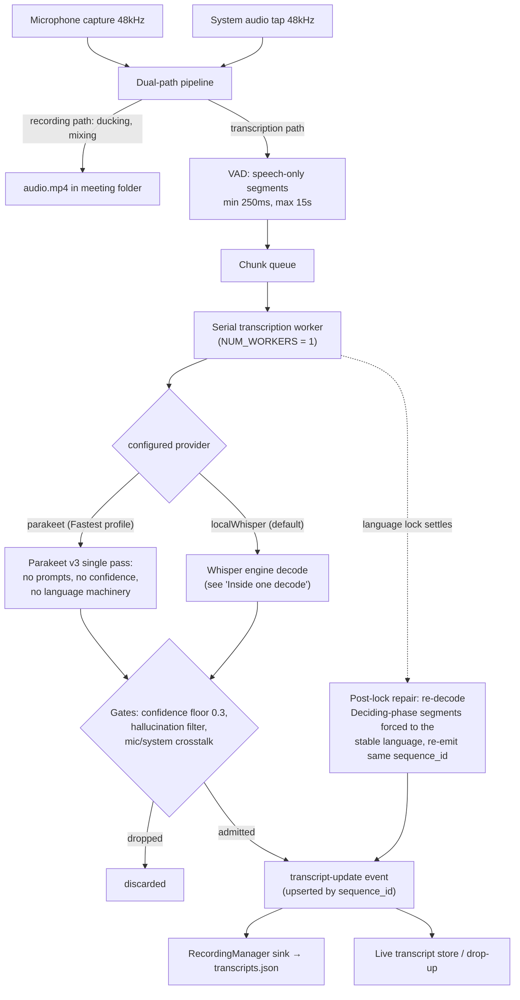
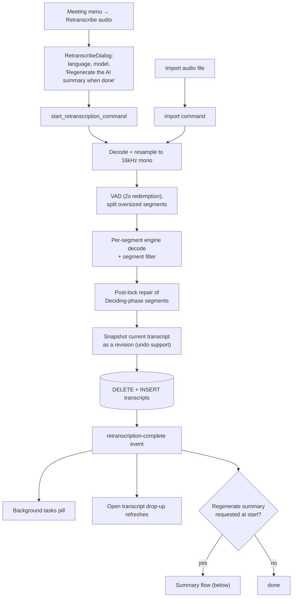
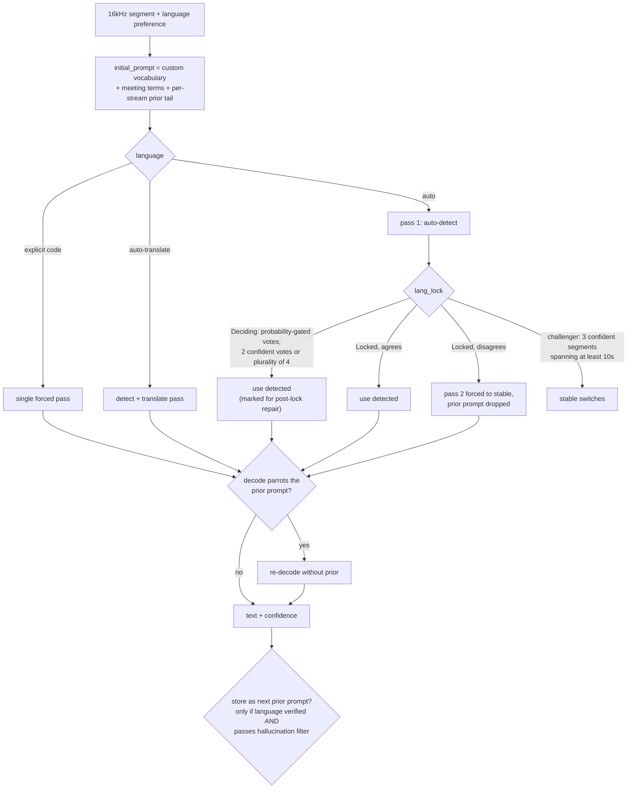
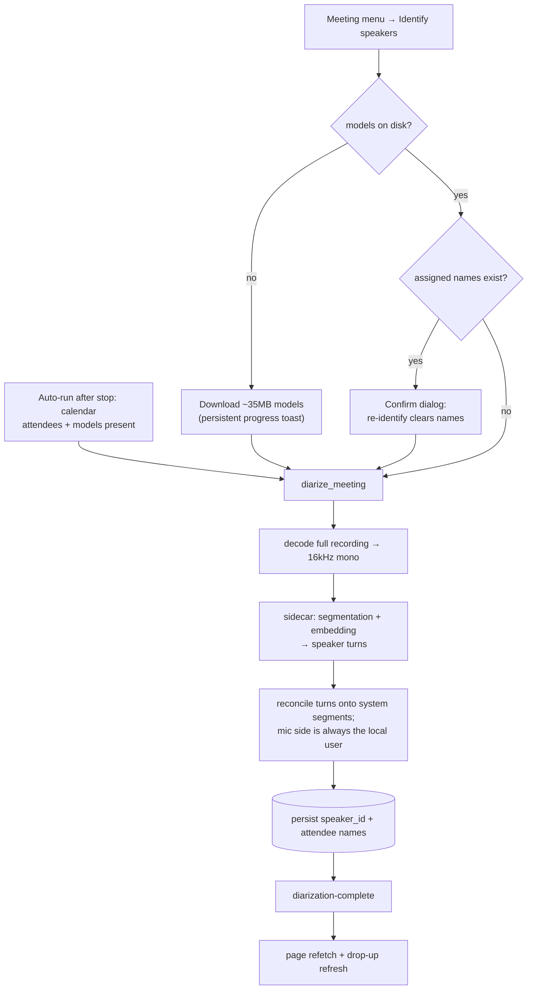
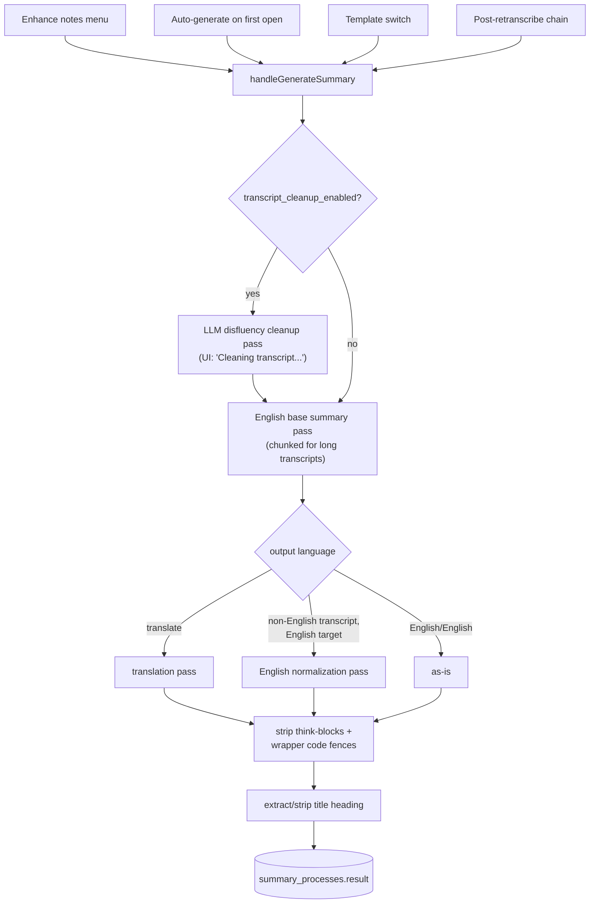

# Transcription flows

Every path audio takes through the app to become transcript text, speaker
labels, and a summary. **Keep this file in sync**: any change to these
pipelines (new stage, new event, moved gate, renamed command) must update the
matching diagram in the same PR.

There are three transcription entry points (live recording, retranscribe,
import) that share one engine, plus two post-processing flows (diarization,
summary) that consume the transcript.

## Live recording

Source: `audio/pipeline.rs`, `audio/transcription/worker.rs`,
`whisper_engine/engine.rs`, `audio/recording_commands/mod.rs`,
`hooks/use-recording-stop.svelte.ts`.

On stop (`use-recording-stop.svelte.ts`): wait for the queue to drain → flush
buffer → save meeting to SQLite. Then, without holding the stop UI: an
optional **quality pass** (a retranscription of the saved file;
`post_meeting_quality_pass` setting) chained into **auto-diarization** (only
if calendar attendees exist and models are downloaded), plus an independent
title pass. The summary auto-generates when the meeting first opens.

The quality pass ALWAYS runs Whisper, regardless of the live provider: with
Parakeet selected for live captions ("Fastest" profile in settings), it is
exactly the pass that upgrades the transcript to whisper quality afterwards.

## Retranscribe (manual) and import

Source: `audio/retranscription.rs`, `audio/import.rs`,
`MeetingDetails/RetranscribeDialog.svelte`, `MeetingDetailsView.svelte`.
Both offline paths share the engine semantics of the live path (language lock,
prompt hygiene, post-lock repair of early segments).

Progress/terminal events: `retranscription-progress` / `-complete` / `-error`,
all carrying `meeting_id`. The summary chain lives in the meeting-details
PAGE, not the view: completing a retranscription refetches the paginated
transcripts, which remounts the keyed `MeetingDetailsView`, so the page sets
`shouldAutoGenerate` and the remounted view generates through the same
mechanism a fresh recording uses. The chain survives the dialog being
backgrounded and the remount, but not leaving the meeting page (a toast says
so); it only fires for runs started from the dialog, never for the
post-recording quality pass.

## Inside one decode (whisper engine)

Source: `whisper_engine/engine.rs`, `lang_lock.rs`, `decode_policy.rs`,
`audio/transcription/segment_filter.rs`.

Everything below is whisper-only. A Parakeet decode is one TDT transducer
pass (`parakeet_engine/engine.rs`): no prompts, no language lock, no echo
breaker, no confidence — only the worker-level gates (hallucination filter,
crosstalk) apply to its output.

Empty decodes climb a temperature ladder (0.0 → 0.8). The hallucination filter
drops exact low-confidence phrases ("Obrigado.", "thank you for watching"),
degenerate repetition loops, and bare-URL segments at any confidence.

## Speaker diarization

Source: `diarization/commands.rs`, `hooks/use-diarization.svelte.ts`,
`hooks/use-recording-stop.svelte.ts` (auto-run).

Events: `diarization-progress` (stages: decode / cluster / label, no
percentage), `diarization-complete`, `diarization-error` — all drive the
background tasks pill, since the auto-run has no other UI.

## Summary generation

Source: `summary/service.rs`, `summary/processor.rs`, `summary/cleanup.rs`.

Every LLM pass output goes through `clean_llm_markdown_output`, which strips
`<think>` blocks and wrapper code fences (including unbalanced ones that small
models emit). User notes are folded into the generation prompt as
`<user_context>`.
